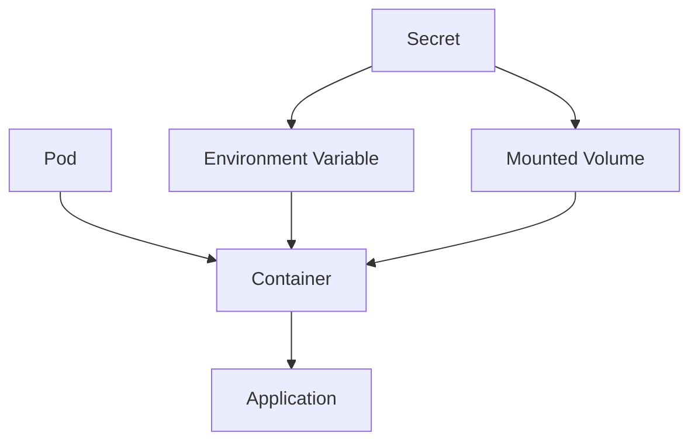

# Lab 03 - Secrets

## Difficulty

⭐⭐ Beginner

## Estimated Time

30–40 minutes

---

# CKA Objectives Covered

* Create Secrets
* View and describe Secrets
* Use Secrets as environment variables
* Mount Secrets as volumes
* Decode Secret values
* Understand Secret security

---

# Objective

In this lab, you will:

* Create a generic Secret.
* Inspect the Secret.
* Decode Secret values.
* Consume the Secret as an environment variable.
* Mount the Secret as a volume.
* Understand Secret best practices.

---

# Architecture



---

# What is a Secret?

A Secret stores sensitive information such as:

* Passwords
* API keys
* Tokens
* TLS certificates

Secrets should be used instead of ConfigMaps for sensitive data.

> **Important:** Secrets are Base64 encoded, not encrypted by default.

---

# Step 1 - Create a Secret

Create a Secret using literals:

```bash id="mq2hjy"
kubectl create secret generic app-secret \
--from-literal=username=admin \
--from-literal=password=SuperSecret123
```

Verify:

```bash id="xrwzuh"
kubectl get secrets
```

Expected:

```text id="2nlq2q"
NAME

app-secret
```

---

# Step 2 - Describe the Secret

```bash id="wlzqyf"
kubectl describe secret app-secret
```

Notice:

* Name
* Type
* Data keys

The actual values are **not** displayed.

---

# Step 3 - View the Secret YAML

```bash id="pcg8xa"
kubectl get secret app-secret -o yaml
```

Example:

```yaml id="7ucy8h"
data:
  username: YWRtaW4=
  password: U3VwZXJTZWNyZXQxMjM=
```

The values are Base64 encoded.

---

# Step 4 - Decode Secret Values

Decode the username:

```bash id="i28gwv"
kubectl get secret app-secret \
-o jsonpath='{.data.username}' | base64 --decode
```

Expected:

```text id="icd0js"
admin
```

Decode the password:

```bash id="g8k21o"
kubectl get secret app-secret \
-o jsonpath='{.data.password}' | base64 --decode
```

Expected:

```text id="08iw3y"
SuperSecret123
```

---

# Step 5 - Use the Secret as Environment Variables

Create:

```text id="ny0mhv"
secret-env-pod.yaml
```

```yaml id="6t2y9d"
apiVersion: v1
kind: Pod

metadata:
  name: secret-env-demo

spec:
  containers:
  - name: app
    image: busybox:1.36
    command:
    - sh
    - -c
    - sleep 3600

    env:
    - name: USERNAME
      valueFrom:
        secretKeyRef:
          name: app-secret
          key: username

    - name: PASSWORD
      valueFrom:
        secretKeyRef:
          name: app-secret
          key: password
```

Apply:

```bash id="e6mdzy"
kubectl apply -f secret-env-pod.yaml
```

---

# Step 6 - Verify Environment Variables

Connect:

```bash id="4zkj0k"
kubectl exec -it secret-env-demo -- sh
```

Run:

```sh id="rvcd2g"
echo $USERNAME

echo $PASSWORD
```

Expected:

```text id="x9r4ob"
admin

SuperSecret123
```

Exit:

```sh id="e8pm4m"
exit
```

---

# Step 7 - Mount the Secret as a Volume

Create:

```text id="kw0w1o"
secret-volume-pod.yaml
```

```yaml id="wpl0im"
apiVersion: v1
kind: Pod

metadata:
  name: secret-volume-demo

spec:
  containers:
  - name: app
    image: busybox:1.36
    command:
    - sh
    - -c
    - sleep 3600

    volumeMounts:
    - name: secret-volume
      mountPath: /etc/secret
      readOnly: true

  volumes:
  - name: secret-volume
    secret:
      secretName: app-secret
```

Apply:

```bash id="8x4jop"
kubectl apply -f secret-volume-pod.yaml
```

---

# Step 8 - Verify Mounted Secret

Connect:

```bash id="dfm7kn"
kubectl exec -it secret-volume-demo -- sh
```

List the files:

```sh id="2y1s7g"
ls -l /etc/secret
```

Expected:

```text id="38n9r0"
username

password
```

Read the files:

```sh id="l0tc6r"
cat /etc/secret/username

cat /etc/secret/password
```

Expected:

```text id="jtyv5q"
admin

SuperSecret123
```

Exit:

```sh id="3m1kfd"
exit
```

---

# Verification Checklist

✅ Secret created.

✅ Secret described.

✅ Secret values decoded.

✅ Secret consumed as environment variables.

✅ Secret mounted as files.

---

# Common Errors

## Secret Not Found

```text id="h5dmev"
secret "app-secret" not found
```

Verify:

```bash id="n1j3vo"
kubectl get secrets
```

Ensure the Secret exists in the same namespace as the Pod.

---

## Wrong Secret Key

Check:

```bash id="sl8w6l"
kubectl describe secret app-secret
```

Verify the key names match the Pod manifest.

---

## Environment Variable Empty

Verify:

```bash id="wzlr1l"
kubectl describe pod secret-env-demo
```

Ensure:

* Secret exists.
* Correct key name is referenced.
* Pod restarted after changes if necessary.

---

# Production Discussion

Best practices:

* Store sensitive data in Secrets, not ConfigMaps.
* Grant Secret access using RBAC.
* Enable etcd encryption at rest.
* Rotate credentials regularly.
* Mount Secrets as read-only volumes.

---

# Real World Notes

Secrets are commonly used for:

* Database passwords
* API tokens
* TLS certificates
* Docker registry credentials
* OAuth credentials

Remember:

Base64 encoding is **not encryption**.

---

# Knowledge Check

1. What is a Kubernetes Secret?
2. How are Secret values stored by default?
3. What are two ways to consume a Secret in a Pod?
4. Why should Secrets be protected with RBAC?
5. Why is Base64 encoding not considered encryption?

---

# Cleanup

```bash id="1vk9ie"
kubectl delete pod secret-env-demo

kubectl delete pod secret-volume-demo

kubectl delete secret app-secret
```

---

# Challenge

1. Create a Secret named `db-secret` with:

* username=dbadmin
* password=MyDBPassword123

2. Mount the Secret as a volume.

3. Read both files inside the Pod.

4. Create another Pod that consumes the same Secret as environment variables.

5. Decode the Secret values using `kubectl`.

6. Explain when you would use environment variables versus mounted Secret files.
