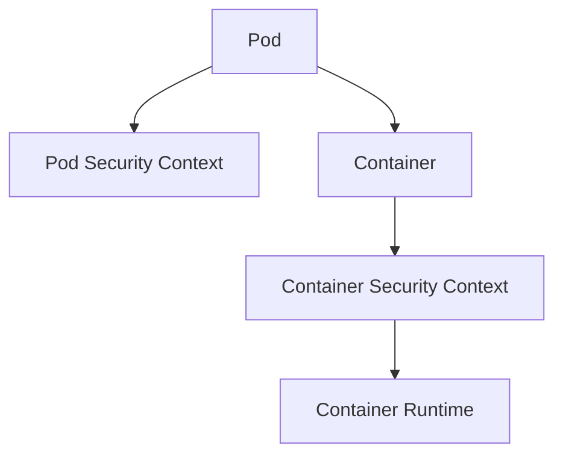

# Lab 04 - Security Context

## Difficulty

⭐⭐⭐ Intermediate

## Estimated Time

30–40 minutes

---

# CKA Objectives Covered

* Configure Pod Security Context
* Configure Container Security Context
* Run a container as a non-root user
* Disable privilege escalation
* Configure a read-only root filesystem
* Verify runtime security settings

---

# Objective

In this lab, you will:

* Create a Pod with a Security Context.
* Run the container as a non-root user.
* Disable privilege escalation.
* Inspect the running user.
* Verify the configured security settings.

---

# Architecture



---

# What is a Security Context?

A Security Context defines security settings for a Pod or container.

Common settings include:

* `runAsUser`
* `runAsGroup`
* `runAsNonRoot`
* `fsGroup`
* `allowPrivilegeEscalation`
* `readOnlyRootFilesystem`

These settings reduce the attack surface of your workloads.

---

# Step 1 - Create a Secure Pod

Create:

```text id="rt0gw3"
security-context-pod.yaml
```

```yaml id="r2w5mq"
apiVersion: v1
kind: Pod

metadata:
  name: secure-pod

spec:

  securityContext:
    runAsUser: 1000
    runAsGroup: 1000
    runAsNonRoot: true
    fsGroup: 1000

  containers:
  - name: app

    image: busybox:1.36

    command:
    - sh
    - -c
    - sleep 3600

    securityContext:
      allowPrivilegeEscalation: false
      readOnlyRootFilesystem: false
```

Apply:

```bash id="y8m2k4"
kubectl apply -f security-context-pod.yaml
```

---

# Step 2 - Verify the Pod

```bash id="77jtxr"
kubectl get pod secure-pod

kubectl describe pod secure-pod
```

Confirm the Pod is running.

---

# Step 3 - Verify the Running User

Connect:

```bash id="lnztvt"
kubectl exec -it secure-pod -- sh
```

Run:

```sh id="1uwy0o"
id
```

Expected:

```text id="w5l7ko"
uid=1000
gid=1000
```

Exit:

```sh id="rb3ybl"
exit
```

---

# Step 4 - Inspect the Security Context

View the Pod YAML:

```bash id="zplw2w"
kubectl get pod secure-pod -o yaml
```

Locate:

```yaml id="otj7nb"
securityContext:
```

Review:

* `runAsUser`
* `runAsGroup`
* `runAsNonRoot`
* `fsGroup`
* `allowPrivilegeEscalation`

---

# Step 5 - Verify Privilege Escalation

Describe the Pod:

```bash id="blv2xm"
kubectl describe pod secure-pod
```

Confirm the container was created with:

```text id="hm71rz"
allowPrivilegeEscalation: false
```

---

# Step 6 - Test File Creation

Connect again:

```bash id="2s7fqq"
kubectl exec -it secure-pod -- sh
```

Create a temporary file:

```sh id="zmrymn"
touch /tmp/testfile

ls -l /tmp/testfile
```

Expected:

The file is created successfully because the root filesystem is still writable (`readOnlyRootFilesystem: false`).

Exit:

```sh id="w0uxg4"
exit
```

---

# Step 7 - Enable a Read-Only Root Filesystem

Update the container Security Context:

```yaml id="yw4xmu"
securityContext:
  allowPrivilegeEscalation: false
  readOnlyRootFilesystem: true
```

Apply the updated manifest:

```bash id="3egv6s"
kubectl apply -f security-context-pod.yaml
```

> Depending on the change, you may need to recreate the Pod:

```bash id="vfjlwm"
kubectl delete pod secure-pod

kubectl apply -f security-context-pod.yaml
```

Reconnect:

```bash id="gzsl0r"
kubectl exec -it secure-pod -- sh
```

Attempt to create a file:

```sh id="d72od0"
touch /tmp/testfile
```

Expected:

The operation may fail because the root filesystem is read-only.

Exit:

```sh id="bcjlwm"
exit
```

> **Note:** Some container images provide writable temporary filesystems or separate writable mounts. The exact behavior may vary depending on the image and runtime.

---

# Verification Checklist

✅ Pod created.

✅ Running as UID 1000.

✅ Running as GID 1000.

✅ Privilege escalation disabled.

✅ Security Context verified.

✅ Read-only filesystem behavior understood.

---

# Common Errors

## Pod Fails to Start

Check:

```bash id="7ib2jt"
kubectl describe pod secure-pod
```

Possible causes:

* Image requires root privileges.
* Invalid Security Context settings.
* Application attempts to write to a read-only filesystem.

---

## Container Still Running as Root

Verify:

```bash id="im4qpr"
kubectl exec -it secure-pod -- id
```

Review:

```bash id="bzgm6d"
kubectl get pod secure-pod -o yaml
```

Ensure `runAsUser` and `runAsNonRoot` are correctly configured.

---

## Write Operations Fail

If `readOnlyRootFilesystem: true` is enabled, ensure the application writes to a mounted writable volume such as `emptyDir` or a PVC.

---

# Production Discussion

Recommended settings for most production workloads:

```yaml id="c8lpk6"
securityContext:
  runAsNonRoot: true
  allowPrivilegeEscalation: false
  readOnlyRootFilesystem: true
```

Adjust as needed for applications that legitimately require writable storage by mounting dedicated volumes.

---

# Real World Notes

Security Contexts reduce the impact of container compromise by:

* Preventing root execution.
* Limiting privilege escalation.
* Restricting filesystem modifications.
* Defining user and group ownership.

They are one layer of Kubernetes defense-in-depth.

---

# Knowledge Check

1. What is a Security Context?
2. What does `runAsNonRoot` enforce?
3. Why disable privilege escalation?
4. What is the purpose of `fsGroup`?
5. When should you enable `readOnlyRootFilesystem`?

---

# Cleanup

```bash id="3kxfjr"
kubectl delete pod secure-pod
```

---

# Challenge

1. Create a Pod that runs as UID **2000**.
2. Configure:

```yaml id="s3od6k"
runAsNonRoot: true
allowPrivilegeEscalation: false
readOnlyRootFilesystem: true
```

3. Verify the runtime user with:

```bash id="08e93s"
kubectl exec -it <pod-name> -- id
```

4. Attempt to create a file in the root filesystem and observe the result.
5. Add an `emptyDir` volume mounted at `/tmp` and verify that the application can write to `/tmp` while the root filesystem remains read-only.
6. Explain why this configuration is recommended for production workloads.
