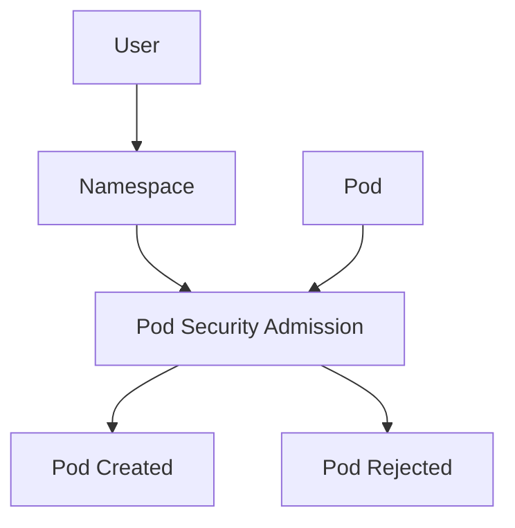

# Lab 05 - Pod Security

## Difficulty

⭐⭐⭐ Intermediate

## Estimated Time

30–40 minutes

---

# CKA Objectives Covered

* Understand Pod Security Admission
* Apply Pod Security labels to namespaces
* Enforce Baseline and Restricted policies
* Verify Pod admission failures
* Understand namespace-level security enforcement

---

# Objective

In this lab, you will:

* Create a namespace.
* Apply Pod Security labels.
* Deploy a compliant Pod.
* Deploy a non-compliant Pod.
* Observe Pod Security Admission behavior.

---

# Architecture



---

# What is Pod Security Admission?

Pod Security Admission (PSA) enforces predefined security standards for Pods at the namespace level.

The three enforcement profiles are:

| Profile    | Purpose                                               |
| ---------- | ----------------------------------------------------- |
| Privileged | Minimal restrictions                                  |
| Baseline   | Prevents common privilege escalation                  |
| Restricted | Strong security controls (recommended for production) |

---

# Step 1 - Create a Namespace

```bash id="1d3yrk"
kubectl create namespace secure-app
```

Verify:

```bash id="qg8qbl"
kubectl get ns
```

---

# Step 2 - Apply Pod Security Labels

Apply the **Restricted** profile:

```bash id="pdm0g0"
kubectl label namespace secure-app \
pod-security.kubernetes.io/enforce=restricted
```

Verify:

```bash id="k46x2u"
kubectl get ns secure-app --show-labels
```

Expected label:

```text id="k3z3aa"
pod-security.kubernetes.io/enforce=restricted
```

---

# Step 3 - Deploy a Compliant Pod

Create:

```text id="01hsv2"
secure-pod.yaml
```

```yaml id="tg4gjz"
apiVersion: v1
kind: Pod

metadata:
  name: secure-pod
  namespace: secure-app

spec:

  securityContext:
    runAsNonRoot: true
    runAsUser: 1000

  containers:
  - name: app
    image: busybox:1.36

    command:
    - sh
    - -c
    - sleep 3600

    securityContext:
      allowPrivilegeEscalation: false

      capabilities:
        drop:
        - ALL
```

Apply:

```bash id="uixvnz"
kubectl apply -f secure-pod.yaml
```

Verify:

```bash id="wvjwnv"
kubectl get pod -n secure-app
```

Expected:

```text id="xtjlwm"
secure-pod   Running
```

---

# Step 4 - Deploy a Non-Compliant Pod

Create:

```text id="66td6w"
privileged-pod.yaml
```

```yaml id="jd1dvc"
apiVersion: v1
kind: Pod

metadata:
  name: privileged-pod
  namespace: secure-app

spec:
  containers:
  - name: app
    image: busybox:1.36

    command:
    - sh
    - -c
    - sleep 3600

    securityContext:
      privileged: true
```

Apply:

```bash id="ehx20w"
kubectl apply -f privileged-pod.yaml
```

Expected:

The Pod should be rejected by Pod Security Admission on clusters where PSA enforcement is enabled.

---

# Step 5 - Inspect the Error

Run:

```bash id="3cgjlwm"
kubectl get events -n secure-app --sort-by=.lastTimestamp
```

Or:

```bash id="bpydmo"
kubectl describe pod privileged-pod -n secure-app
```

Look for messages indicating the Pod violates the namespace's Pod Security policy.

> **Note:** The exact wording varies by Kubernetes version.

---

# Step 6 - Switch to Baseline

Update the namespace:

```bash id="wjlwmm"
kubectl label namespace secure-app \
pod-security.kubernetes.io/enforce=baseline \
--overwrite
```

Verify:

```bash id="95awp8"
kubectl get ns secure-app --show-labels
```

Observe how changing the enforcement level can affect what workloads are permitted.

---

# Verification Checklist

✅ Namespace created.

✅ Pod Security label applied.

✅ Compliant Pod started successfully.

✅ Non-compliant Pod rejected (on PSA-enabled clusters).

✅ Namespace labels verified.

---

# Common Errors

## Labels Not Applied

Verify:

```bash id="4rzef8"
kubectl get ns secure-app --show-labels
```

---

## Pod Still Starts

Possible causes:

* Pod Security Admission is not enabled.
* The Kubernetes version or distribution does not enforce PSA by default.
* Namespace labels were not applied correctly.

---

## Pod Rejected Unexpectedly

Review:

```bash id="n3gx5z"
kubectl describe pod <pod-name> -n secure-app

kubectl get events -n secure-app
```

Check which security requirement was violated.

---

# Production Discussion

The **Restricted** profile is recommended for most production application namespaces.

Typical requirements include:

* Run as non-root.
* Drop unnecessary Linux capabilities.
* Disable privilege escalation.
* Avoid privileged containers.
* Avoid host namespaces unless required.

Some infrastructure components (for example, certain networking or storage agents) may require different settings and should be isolated appropriately.

---

# Real World Notes

Pod Security Admission is configured **per namespace** using labels.

It applies to all new Pod creations in that namespace, helping enforce consistent security standards without modifying every individual manifest.

---

# Knowledge Check

1. What is Pod Security Admission?
2. Which profile is recommended for production applications?
3. Where are Pod Security Standards enforced?
4. Why might a Pod be rejected?
5. What is the difference between **Restricted** and **Baseline**?

---

# Cleanup

```bash id="r5xv7o"
kubectl delete namespace secure-app
```

---

# Challenge

1. Create a namespace named `production`.
2. Apply the **Restricted** Pod Security profile.
3. Deploy a compliant Pod using:

   * `runAsNonRoot: true`
   * `allowPrivilegeEscalation: false`
   * `capabilities.drop: ["ALL"]`
4. Verify the Pod runs successfully.
5. Attempt to deploy a privileged Pod.
6. Observe and explain why it is accepted or rejected.
7. Change the namespace to the **Baseline** profile and compare the behavior.
