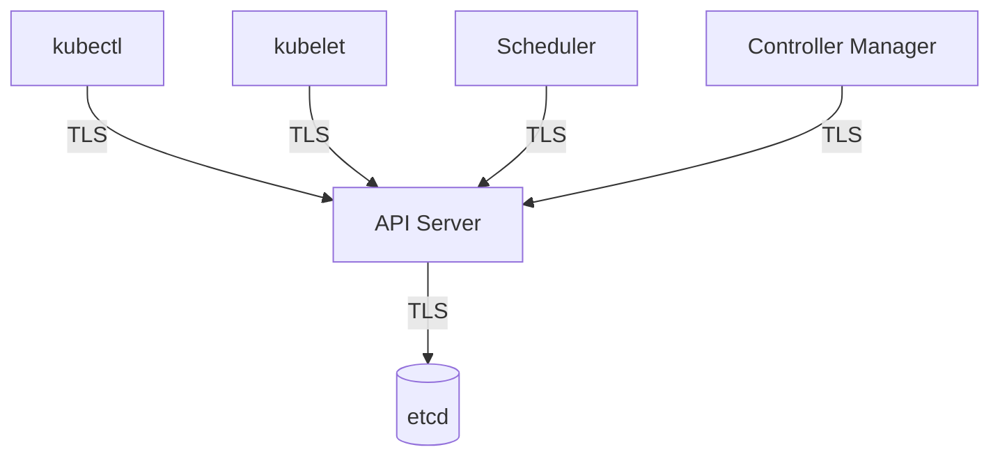

# Lab 06 - Certificates

## Difficulty

⭐⭐⭐⭐ Intermediate

## Estimated Time

30–40 minutes

---

# CKA Objectives Covered

* Understand Kubernetes PKI
* Inspect kubeconfig certificates
* Understand TLS communication
* Identify certificate usage
* Verify cluster connection information

---

# Objective

In this lab, you will:

* Understand the Kubernetes certificate architecture.
* Inspect the current kubeconfig.
* View cluster and user information.
* Identify certificate-based authentication.
* Understand how Kubernetes components communicate securely.

---

# Architecture



---

# What are Kubernetes Certificates?

Kubernetes uses **TLS certificates** to:

* Authenticate cluster components.
* Encrypt communication.
* Prevent unauthorized access.
* Verify trusted identities.

Nearly every communication channel inside Kubernetes is protected using TLS.

---

# Step 1 - View Cluster Information

```bash id="9ktj1h"
kubectl cluster-info
```

Example:

```text id="m8g42k"
Kubernetes control plane is running at:
https://127.0.0.1:6443
```

---

# Step 2 - View the Current Context

```bash id="3s3v3t"
kubectl config current-context
```

Example:

```text id="83pk1y"
docker-desktop
```

Your context name may be different.

---

# Step 3 - View kubeconfig

```bash id="jj3cmq"
kubectl config view
```

Observe the sections:

* clusters
* users
* contexts

Notice fields such as:

```text id="vlmwqm"
certificate-authority-data

client-certificate-data

client-key-data
```

These contain the certificate information used by `kubectl`.

---

# Step 4 - View the Active Configuration

```bash id="xumtx6"
kubectl config view --minify
```

This displays only the active cluster, user, and context.

---

# Step 5 - List Available Contexts

```bash id="rjlwmm"
kubectl config get-contexts
```

Example:

```text id="oapwqa"
CURRENT   NAME

*         docker-desktop
```

---

# Step 6 - View the Current User

```bash id="jlwm0q"
kubectl config view --minify
```

Locate:

```text id="ytm3ci"
users:
```

This identifies the user credentials that `kubectl` is using.

---

# Step 7 - Understand the Certificate Chain

Typical Kubernetes trust relationship:

```text id="eujcyw"
Certificate Authority (CA)

↓

API Server Certificate

↓

Client Certificate

↓

Authenticated Request
```

The cluster trusts identities signed by the cluster's Certificate Authority.

---

# Step 8 - Understand Component Certificates

| Component          | Uses Certificate |
| ------------------ | ---------------- |
| kubectl            | ✅                |
| API Server         | ✅                |
| kubelet            | ✅                |
| Controller Manager | ✅                |
| Scheduler          | ✅                |
| etcd               | ✅                |

TLS secures communication between these components.

---

# Step 9 - Verify API Connectivity

```bash id="jlwm8s"
kubectl get nodes
```

If this succeeds:

* Your kubeconfig is valid.
* Authentication succeeded.
* TLS negotiation succeeded.
* The API server is reachable.

---

# Verification Checklist

✅ Cluster information viewed.

✅ Current context identified.

✅ kubeconfig inspected.

✅ Certificate-related fields identified.

✅ API connectivity verified.

---

# Common Errors

## x509 Certificate Error

Example:

```text id="jlwm0m"
x509: certificate signed by unknown authority
```

Possible causes:

* Incorrect CA certificate.
* Wrong kubeconfig.
* Untrusted certificate authority.

---

## Unauthorized

Example:

```text id="jlwmf8"
Unauthorized
```

Possible causes:

* Invalid client certificate.
* Expired credentials.
* Incorrect user configuration.

---

## Cannot Connect to API Server

Check:

```bash id="jlwmzx"
kubectl cluster-info

kubectl config current-context
```

Verify:

* API server is running.
* Correct context is selected.
* kubeconfig is valid.

---

# Production Discussion

Production best practices:

* Rotate certificates before expiration.
* Protect private keys.
* Use separate client identities.
* Limit administrative access.
* Back up Certificate Authority (CA) material securely.

---

# Real World Notes

Managed Kubernetes services (such as Amazon EKS, Azure AKS, and Google GKE) automatically manage many control plane certificates.

Cluster administrators are still responsible for protecting kubeconfig files and client credentials.

---

# Knowledge Check

1. Why does Kubernetes use TLS certificates?
2. What is the purpose of the Certificate Authority (CA)?
3. Which command displays the active kubeconfig?
4. What information does a kubeconfig contain?
5. What does an x509 certificate error usually indicate?

---

# Cleanup

No cleanup is required.

This lab only inspects cluster configuration.

---

# Challenge

1. Display the active kubeconfig.
2. Identify:

   * Current context
   * Current user
   * Current cluster
3. Locate:

   * `certificate-authority-data`
   * `client-certificate-data`
   * `client-key-data`
4. Verify cluster connectivity with:

```bash id="jlwmhq"
kubectl get nodes
```

5. Explain how the Certificate Authority establishes trust between `kubectl` and the Kubernetes API server.
