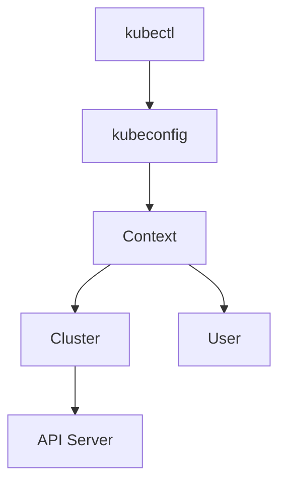

# Lab 07 - Kubeconfig

## Difficulty

⭐⭐⭐⭐ Intermediate

## Estimated Time

30–40 minutes

---

# CKA Objectives Covered

* Understand kubeconfig structure
* View clusters, users, and contexts
* Switch contexts
* Use alternate kubeconfig files
* Troubleshoot kubeconfig issues

---

# Objective

In this lab, you will:

* Inspect your kubeconfig.
* Understand the relationship between clusters, users, and contexts.
* Switch between contexts.
* Use an alternate kubeconfig file.
* Troubleshoot common kubeconfig problems.

---

# Architecture



---

# What is kubeconfig?

A **kubeconfig** file tells `kubectl`:

* Which cluster to connect to.
* Which user credentials to use.
* Which context is currently active.

The default location is:

```text
~/.kube/config
```

---

# kubeconfig Structure

A kubeconfig contains three main sections:

```text
clusters

users

contexts
```

Relationship:

```text
Context

↓

Cluster

+

User
```

A context simply combines a cluster with a user.

---

# Step 1 - View the Current kubeconfig

```bash
kubectl config view
```

Observe:

* clusters
* users
* contexts

---

# Step 2 - View Only the Active Configuration

```bash
kubectl config view --minify
```

This shows only the currently selected cluster, user, and context.

---

# Step 3 - View Current Context

```bash
kubectl config current-context
```

Example:

```text
docker-desktop
```

---

# Step 4 - List Available Contexts

```bash
kubectl config get-contexts
```

Example:

```text
CURRENT   NAME

*         docker-desktop

          kind

          minikube
```

The `*` indicates the active context.

---

# Step 5 - Switch Contexts

If multiple contexts exist:

```bash
kubectl config use-context <context-name>
```

Example:

```bash
kubectl config use-context minikube
```

Verify:

```bash
kubectl config current-context
```

> If your kubeconfig contains only one context, this step is informational.

---

# Step 6 - View Cluster Information

```bash
kubectl cluster-info
```

Verify the active cluster endpoint.

---

# Step 7 - View Nodes

```bash
kubectl get nodes
```

Successful output confirms:

* kubeconfig is valid.
* Authentication succeeded.
* API server is reachable.

---

# Step 8 - Use an Alternate kubeconfig

You can temporarily use another kubeconfig file:

```bash
KUBECONFIG=/path/to/config kubectl get nodes
```

Or:

```bash
kubectl --kubeconfig=/path/to/config get nodes
```

This is useful when managing multiple clusters.

---

# Step 9 - Inspect the Current User

```bash
kubectl config view --minify
```

Locate:

```text
users:
```

Identify which credentials are being used for the active context.

---

# Step 10 - View Cluster Details

Display cluster information:

```bash
kubectl config view -o yaml
```

Look for:

```text
clusters

server

certificate-authority-data
```

---

# Verification Checklist

✅ kubeconfig inspected.

✅ Current context identified.

✅ Available contexts listed.

✅ Cluster connectivity verified.

✅ Alternate kubeconfig usage understood.

---

# Common Errors

## No Current Context

Example:

```text
error: current-context is not set
```

Resolution:

```bash
kubectl config get-contexts

kubectl config use-context <context-name>
```

---

## Cannot Connect to Cluster

Example:

```text
The connection to the server was refused
```

Verify:

```bash
kubectl cluster-info

kubectl config current-context
```

Check:

* Cluster is running.
* Correct server endpoint.
* Network connectivity.

---

## Unauthorized

Example:

```text
Unauthorized
```

Possible causes:

* Invalid credentials.
* Expired certificate.
* Wrong user configuration.

Inspect:

```bash
kubectl config view --minify
```

---

# Production Discussion

Best practices:

* Keep separate kubeconfig files for different environments.
* Protect kubeconfig files because they contain credentials.
* Avoid sharing administrative kubeconfig files.
* Use least-privilege credentials whenever possible.

---

# Real World Notes

A common setup is:

```text
Development Cluster

↓

dev.kubeconfig

Production Cluster

↓

prod.kubeconfig

Testing Cluster

↓

test.kubeconfig
```

Administrators switch between them using contexts or the `--kubeconfig` option.

---

# Knowledge Check

1. What is a kubeconfig?
2. What are the three main sections of a kubeconfig?
3. What is a context?
4. Which command switches contexts?
5. How can you use a different kubeconfig file for a single command?

---

# Cleanup

No cleanup is required.

This lab only inspects configuration.

---

# Challenge

1. Display the active kubeconfig.
2. List all contexts.
3. Identify:

   * Current cluster
   * Current user
   * Current context
4. If multiple contexts exist, switch to another context and switch back.
5. Run:

```bash
kubectl cluster-info

kubectl get nodes
```

6. Explain how a context links a cluster and a user.
