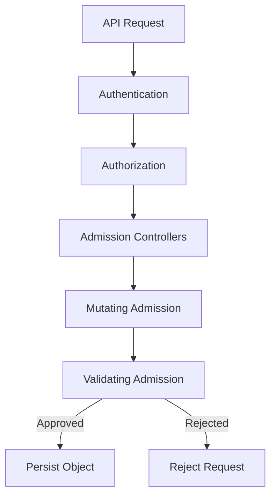

# Lab 08 - Admission Controllers

## Difficulty

⭐⭐⭐⭐ Intermediate

## Estimated Time

30–40 minutes

---

# CKA Objectives Covered

* Understand Admission Controllers
* Understand Mutating and Validating Admission
* View enabled admission plugins
* Understand request flow
* Troubleshoot admission failures

---

# Objective

In this lab, you will:

* Understand where Admission Controllers fit in the API request lifecycle.
* Learn the difference between mutating and validating admission.
* Inspect your cluster for admission-related behavior.
* Observe admission rejection messages.
* Learn common production admission controllers.

---

# Architecture



---

# What are Admission Controllers?

Admission Controllers intercept requests **after authentication and authorization** but **before Kubernetes stores the object in etcd**.

They can:

* Validate requests.
* Modify requests.
* Enforce cluster policies.

---

# Kubernetes Request Flow

```text
User

↓

Authentication

↓

Authorization

↓

Admission Controllers

↓

API Server

↓

etcd
```

Admission Controllers are the final checkpoint before an object is created.

---

# Step 1 - View API Server Information

```bash
kubectl cluster-info
```

Admission Controllers run inside the Kubernetes API server.

On managed Kubernetes platforms, the enabled admission plugins are managed by the provider.

---

# Step 2 - Understand Mutating Admission

Mutating Admission Controllers can automatically modify objects.

Example:

A Pod is submitted without labels.

A Mutating Admission Controller may automatically add:

```yaml
metadata:
  labels:
    environment: production
```

The object is changed before being stored.

---

# Step 3 - Understand Validating Admission

Validating Admission Controllers inspect requests but **do not modify them**.

Example:

A policy requires every container to:

```yaml
securityContext:
  runAsNonRoot: true
```

If the field is missing:

The request is rejected.

---

# Step 4 - Observe a Validation Failure

If your cluster enforces Pod Security Admission or other validation policies, create a Pod that violates the policy.

Example:

```yaml
apiVersion: v1
kind: Pod

metadata:
  name: privileged-demo

spec:
  containers:
  - name: app
    image: busybox:1.36

    command:
    - sh
    - -c
    - sleep 3600

    securityContext:
      privileged: true
```

Apply:

```bash
kubectl apply -f privileged-demo.yaml
```

Possible result:

```text
Error from server:

admission webhook denied the request
```

> The exact error depends on your Kubernetes distribution and enabled admission policies.

---

# Step 5 - Inspect Events

```bash
kubectl get events --sort-by=.lastTimestamp
```

Or:

```bash
kubectl describe pod privileged-demo
```

Review the error message to determine which admission policy rejected the request.

---

# Step 6 - Common Built-in Admission Controllers

Examples include:

| Admission Controller | Purpose                          |
| -------------------- | -------------------------------- |
| NamespaceLifecycle   | Validates namespace lifecycle    |
| LimitRanger          | Applies default resource limits  |
| ResourceQuota        | Enforces namespace quotas        |
| DefaultStorageClass  | Assigns the default StorageClass |
| PodSecurity          | Enforces Pod Security Standards  |

---

# Step 7 - Mutating vs Validating

| Mutating               | Validating                   |
| ---------------------- | ---------------------------- |
| Can modify objects     | Cannot modify objects        |
| Runs before validation | Runs after mutation          |
| Adds or changes fields | Approves or rejects requests |

---

# Step 8 - Request Lifecycle Review

```text
API Request

↓

Authentication

↓

Authorization

↓

Mutating Admission

↓

Validating Admission

↓

Stored in etcd
```

If validation fails, the object is never stored.

---

# Verification Checklist

✅ Admission Controller purpose understood.

✅ Mutating vs Validating understood.

✅ Request lifecycle understood.

✅ Admission rejection messages reviewed.

---

# Common Errors

## Admission Webhook Denied

Example:

```text
admission webhook denied the request
```

Resolution:

* Read the complete error.
* Identify which policy rejected the request.
* Update the manifest to satisfy the policy.

---

## Pod Security Violation

Example:

```text
violates PodSecurity
```

Review:

* Namespace labels.
* Security Context.
* Privileged settings.

---

## Validation Failure

Review:

```bash
kubectl describe pod <pod-name>

kubectl get events
```

Look for the first validation error.

---

# Production Discussion

Admission Controllers are commonly used to:

* Enforce naming standards.
* Require labels.
* Prevent privileged containers.
* Inject sidecars.
* Apply default values.
* Enforce security policies.
* Validate resource configuration.

Examples:

* Pod Security Admission
* Service mesh sidecar injection
* Organization-specific validation policies

---

# Real World Notes

Admission Controllers complement RBAC.

RBAC answers:

> Can this user perform the action?

Admission Controllers answer:

> Should this object be accepted?

Both are required for a secure Kubernetes cluster.

---

# Knowledge Check

1. When do Admission Controllers run?
2. What is the difference between Mutating and Validating Admission?
3. Can a Validating Admission Controller modify an object?
4. Which component stores objects after admission succeeds?
5. Why are Admission Controllers important?

---

# Cleanup

```bash
kubectl delete pod privileged-demo --ignore-not-found
```

---

# Challenge

1. Explain the complete Kubernetes request flow from `kubectl apply` to object creation.
2. Identify where:

   * Authentication occurs.
   * Authorization occurs.
   * Admission Controllers execute.
3. Explain the difference between Mutating and Validating Admission.
4. Research which admission policies are enabled in your Kubernetes distribution.
5. Describe a real-world scenario where a Mutating Admission Controller would automatically modify a Pod before it is created.
