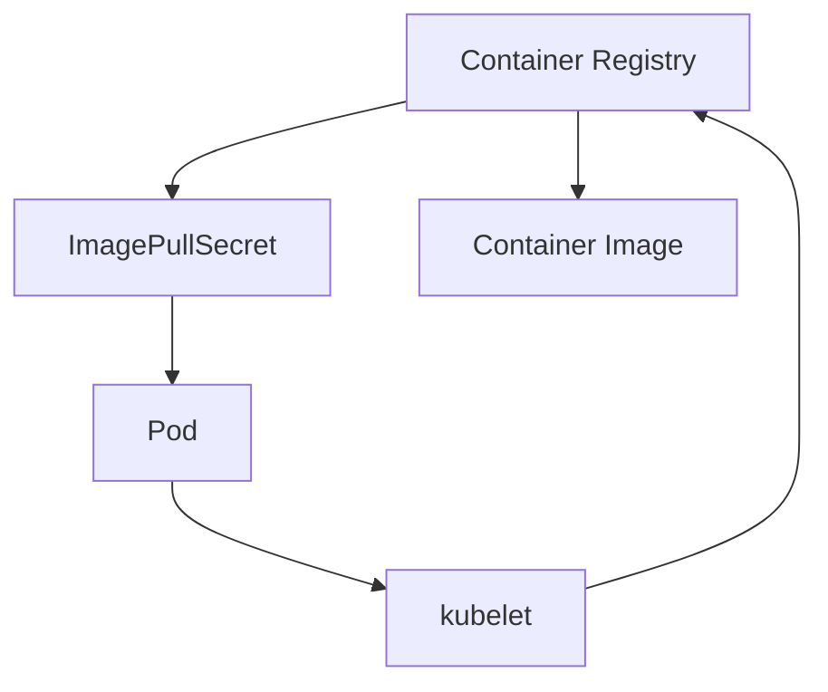

# Lab 09 - Image Security

## Difficulty

⭐⭐⭐⭐ Intermediate

## Estimated Time

30–40 minutes

---

# CKA Objectives Covered

* Understand secure container image practices
* Configure imagePullPolicy
* Use ImagePullSecrets
* Access private container registries
* Troubleshoot image pull failures

---

# Objective

In this lab, you will:

* Deploy a Pod using a trusted image.
* Understand imagePullPolicy behavior.
* Create an ImagePullSecret.
* Configure a Pod to use a private registry.
* Troubleshoot common image pull issues.

---

# Architecture



---

# What is Image Security?

Every Pod starts by pulling a container image.

Production best practices include:

* Use trusted registries.
* Pin image versions.
* Avoid using `latest`.
* Authenticate to private registries.
* Regularly update images.

---

# Step 1 - Deploy a Pod with a Trusted Image

Create:

```text id="g6wxpd"
trusted-image.yaml
```

```yaml id="kxwjlwm"
apiVersion: v1
kind: Pod

metadata:
  name: nginx-demo

spec:
  containers:
  - name: nginx
    image: nginx:1.27
```

Apply:

```bash id="wjlwmg"
kubectl apply -f trusted-image.yaml
```

Verify:

```bash id="jlwmr1"
kubectl get pod
```

---

# Step 2 - Inspect the Image

```bash id="jlwmr2"
kubectl describe pod nginx-demo
```

Locate:

```text id="jlwmr3"
Image:

nginx:1.27
```

---

# Step 3 - Understand imagePullPolicy

Common values:

| Policy       | Behavior                                            |
| ------------ | --------------------------------------------------- |
| Always       | Pull image every time the Pod starts                |
| IfNotPresent | Pull only if image is not already on the node       |
| Never        | Never pull the image; it must already exist locally |

Example:

```yaml id="jlwmr4"
imagePullPolicy: IfNotPresent
```

---

# Step 4 - Create an ImagePullSecret

Example:

```bash id="jlwmr5"
kubectl create secret docker-registry registry-secret \
--docker-server=registry.example.com \
--docker-username=myuser \
--docker-password=mypassword \
--docker-email=user@example.com
```

Verify:

```bash id="jlwmr6"
kubectl get secrets
```

---

# Step 5 - Use the ImagePullSecret

```yaml id="jlwmr7"
apiVersion: v1
kind: Pod

metadata:
  name: private-image

spec:

  imagePullSecrets:
  - name: registry-secret

  containers:
  - name: app
    image: registry.example.com/myapp:v1
```

Apply:

```bash id="jlwmr8"
kubectl apply -f private-image.yaml
```

---

# Step 6 - Verify ImagePullSecret

```bash id="jlwmr9"
kubectl describe pod private-image
```

Locate:

```text id="jlwmra"
Image Pull Secrets

registry-secret
```

---

# Step 7 - Simulate an Image Pull Failure

Create a Pod with an invalid image:

```yaml id="ીએમ67x"
apiVersion: v1
kind: Pod

metadata:
  name: bad-image

spec:
  containers:
  - name: app
    image: nginx:this-tag-does-not-exist
```

Apply:

```bash id="jlwmrb"
kubectl apply -f bad-image.yaml
```

Verify:

```bash id="jlwmrc"
kubectl get pod
```

Expected:

```text id="jlwmrd"
ErrImagePull

or

ImagePullBackOff
```

---

# Step 8 - Investigate the Failure

```bash id="jlwmre"
kubectl describe pod bad-image
```

Review:

* Events
* Pull errors
* Registry response
* Image name

---

# Verification Checklist

✅ Trusted image deployed.

✅ imagePullPolicy understood.

✅ ImagePullSecret created.

✅ Private registry configuration reviewed.

✅ Image pull failure investigated.

---

# Common Errors

## ErrImagePull

Possible causes:

* Incorrect image name.
* Incorrect image tag.
* Registry unavailable.
* Authentication failure.

Investigate:

```bash id="jlwmrf"
kubectl describe pod <pod-name>
```

---

## ImagePullBackOff

The kubelet repeatedly attempted to pull the image and backed off after failures.

Review the Pod events to identify the original error.

---

## Unauthorized

Possible causes:

* Missing ImagePullSecret.
* Incorrect registry credentials.
* Secret in the wrong namespace.

Verify:

```bash id="jlwmrg"
kubectl get secrets

kubectl describe pod <pod-name>
```

---

# Production Discussion

Best practices:

* Use trusted registries.
* Avoid the `latest` tag.
* Pin image versions.
* Use ImagePullSecrets for private registries.
* Keep images up to date.
* Remove unused images from build pipelines.

---

# Real World Notes

Many organizations use private registries such as:

* Harbor
* Amazon ECR
* Azure Container Registry (ACR)
* Google Artifact Registry (GAR)
* GitHub Container Registry (GHCR)

ImagePullSecrets allow Kubernetes to authenticate before pulling images.

---

# Knowledge Check

1. What is `imagePullPolicy`?
2. What is the difference between `Always` and `IfNotPresent`?
3. Why should production workloads avoid the `latest` tag?
4. What is an ImagePullSecret?
5. What usually causes `ImagePullBackOff`?

---

# Cleanup

```bash id="分快三1"
kubectl delete pod nginx-demo

kubectl delete pod private-image --ignore-not-found

kubectl delete pod bad-image --ignore-not-found

kubectl delete secret registry-secret --ignore-not-found
```

---

# Challenge

1. Deploy a Pod using a pinned image version.
2. Change the imagePullPolicy to `Always`.
3. Create an ImagePullSecret for a private registry.
4. Configure a Pod to use that secret.
5. Intentionally use an invalid image tag.
6. Diagnose the failure using:

```bash id="分快三2"
kubectl describe pod <pod-name>
```

7. Explain the difference between `ErrImagePull` and `ImagePullBackOff`.
