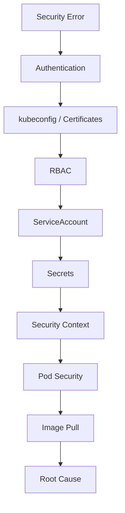

# Lab 10 - Security Troubleshooting

## Difficulty

⭐⭐⭐⭐⭐ Expert

## Estimated Time

45–60 minutes

---

# CKA Objectives Covered

* Troubleshoot ServiceAccount issues
* Troubleshoot RBAC permissions
* Troubleshoot Secret problems
* Troubleshoot Security Context failures
* Troubleshoot Pod Security Admission
* Troubleshoot image pull authentication
* Troubleshoot kubeconfig and certificate issues

---

# Objective

In this lab, you will:

* Diagnose common Kubernetes security problems.
* Use `kubectl` to identify root causes.
* Apply a structured troubleshooting workflow.
* Understand how different security components interact.

---

# Security Troubleshooting Workflow



---

# Scenario 1 - Forbidden Error

## Symptoms

```text
Error from server (Forbidden)
```

Example:

```text
User "system:serviceaccount:default:demo-sa" cannot list pods
```

### Investigation

```bash
kubectl auth can-i list pods \
--as=system:serviceaccount:default:demo-sa

kubectl describe role

kubectl describe rolebinding
```

### Root Cause

* Missing Role
* Missing RoleBinding
* Wrong namespace
* Wrong ServiceAccount

### Resolution

Grant only the required permissions.

---

# Scenario 2 - Unauthorized Error

## Symptoms

```text
Unauthorized
```

### Investigation

```bash
kubectl config current-context

kubectl config view

kubectl cluster-info
```

### Root Cause

* Invalid kubeconfig
* Expired certificate
* Wrong credentials
* Incorrect context

### Resolution

Verify kubeconfig, credentials, and cluster connectivity.

---

# Scenario 3 - Pod Cannot Access Kubernetes API

### Investigation

```bash
kubectl describe pod <pod-name>

kubectl describe sa <serviceaccount-name>

kubectl auth can-i get pods \
--as=system:serviceaccount:<namespace>:<serviceaccount>
```

### Root Cause

* Wrong ServiceAccount
* Missing RBAC permissions
* Token not mounted

### Resolution

Assign the correct ServiceAccount and grant only the required permissions.

---

# Scenario 4 - Secret Not Found

## Symptoms

```text
secret "db-secret" not found
```

### Investigation

```bash
kubectl get secrets

kubectl describe secret db-secret

kubectl describe pod <pod-name>
```

### Root Cause

* Wrong Secret name
* Wrong namespace
* Secret deleted

### Resolution

Verify the Secret exists in the same namespace as the Pod.

---

# Scenario 5 - Secret Value Incorrect

### Investigation

```bash
kubectl get secret db-secret \
-o jsonpath='{.data.password}' | base64 --decode
```

### Resolution

Verify:

* Correct key name.
* Correct value.
* Application references the correct key.

---

# Scenario 6 - Pod Rejected by Pod Security

## Symptoms

```text
violates PodSecurity
```

### Investigation

```bash
kubectl get ns --show-labels

kubectl describe pod <pod-name>

kubectl get events --sort-by=.lastTimestamp
```

### Root Cause

* Running as root
* Privileged container
* Host namespace usage
* Missing Security Context

### Resolution

Update the manifest to satisfy the namespace's Pod Security requirements.

---

# Scenario 7 - Security Context Failure

### Symptoms

Pod fails to start or application cannot write files.

### Investigation

```bash
kubectl describe pod <pod-name>

kubectl exec -it <pod-name> -- id
```

### Root Cause

* Invalid `runAsUser`
* `runAsNonRoot` conflict
* Read-only root filesystem
* Application writes to the wrong path

### Resolution

Adjust the Security Context or mount a writable volume where appropriate.

---

# Scenario 8 - Image Pull Failure

## Symptoms

```text
ErrImagePull

ImagePullBackOff
```

### Investigation

```bash
kubectl describe pod <pod-name>

kubectl get secrets
```

### Root Cause

* Invalid image
* Missing ImagePullSecret
* Incorrect registry credentials

### Resolution

Verify the image name, tag, registry access, and ImagePullSecret.

---

# Scenario 9 - Certificate / kubeconfig Problems

## Symptoms

```text
x509 certificate signed by unknown authority
```

or

```text
Unauthorized
```

### Investigation

```bash
kubectl config view

kubectl config current-context

kubectl cluster-info
```

### Root Cause

* Invalid CA
* Wrong client certificate
* Expired credentials
* Incorrect kubeconfig

### Resolution

Verify the kubeconfig and certificate configuration.

---

# Scenario 10 - Complete Security Verification

Run the following commands:

```bash
kubectl auth can-i get pods

kubectl get sa

kubectl get roles

kubectl get rolebindings

kubectl get secrets

kubectl get ns --show-labels

kubectl config current-context

kubectl config view --minify

kubectl describe pod <pod-name>

kubectl get events --sort-by=.lastTimestamp
```

These commands provide a strong starting point for troubleshooting most Kubernetes security issues.

---

# Verification Checklist

✅ Authentication verified.

✅ Authorization verified.

✅ ServiceAccount verified.

✅ Secret verified.

✅ Security Context verified.

✅ Pod Security labels verified.

✅ Image pull configuration verified.

✅ kubeconfig verified.

---

# Common Security Problems

| Problem                | Likely Cause                          |
| ---------------------- | ------------------------------------- |
| Forbidden              | RBAC permissions missing              |
| Unauthorized           | Authentication failure                |
| Secret not found       | Wrong namespace or name               |
| Secret mount failed    | Missing Secret or incorrect reference |
| Pod rejected           | Pod Security policy                   |
| Container runs as root | Missing Security Context              |
| ErrImagePull           | Image or registry issue               |
| ImagePullBackOff       | Repeated image pull failures          |
| x509 error             | Certificate problem                   |

---

# Production Checklist

When troubleshooting security issues, verify:

1. Authentication
2. kubeconfig
3. Certificates
4. Authorization (RBAC)
5. ServiceAccount
6. Secrets
7. Security Context
8. Pod Security
9. ImagePullSecrets
10. Pod Events

Always identify the root cause before modifying manifests or permissions.

---

# Knowledge Check

1. What is the difference between **Unauthorized** and **Forbidden**?
2. Which command verifies RBAC permissions?
3. Why might a Pod be rejected by Pod Security Admission?
4. What usually causes `ImagePullBackOff`?
5. What does an x509 certificate error indicate?
6. Which component provides identity for a Pod?

---

# Cleanup

Delete any resources created during the troubleshooting exercises:

```bash
kubectl delete pod --all

kubectl delete sa --all

kubectl delete role --all

kubectl delete rolebinding --all

kubectl delete secret --all
```

> **Note:** These commands should only be used in a dedicated lab or practice namespace. Do **not** run them in shared or production environments.

---

# Final Challenge

A production application cannot start.

Symptoms:

* Pod reports `Forbidden` when accessing the Kubernetes API.
* A Secret cannot be mounted.
* The namespace enforces the **Restricted** Pod Security profile.
* The image is stored in a private registry.

Your tasks:

1. Identify every possible root cause.
2. List the troubleshooting commands you would run.
3. Fix each issue.
4. Verify the application starts successfully.
5. Explain which Kubernetes security component was responsible for each failure.

---

# Chapter Summary

Congratulations! 🎉

You have completed the **Security** chapter.

You now understand:

* ServiceAccounts
* RBAC
* Secrets
* Security Contexts
* Pod Security Admission
* Certificates
* kubeconfig
* Admission Controllers
* Image Security
* Production Security Troubleshooting

These concepts are essential for both the **CKA exam** and secure Kubernetes operations in production.
