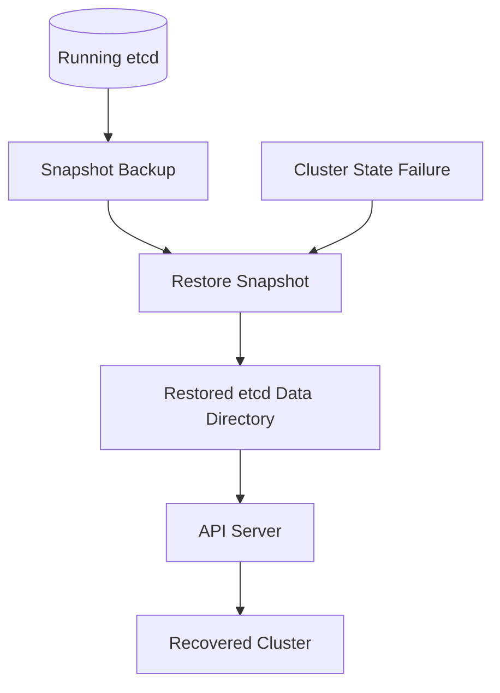

# etcd Backup and Restore

```mermaid
flowchart TD
    Etcd[(Running etcd)]
    Snapshot[Snapshot Backup]
    Failure[Cluster State Failure]
    Restore[Restore Snapshot]
    NewDataDir[Restored etcd Data Directory]
    APIServer[API Server]
    Cluster[Recovered Cluster]

    Etcd --> Snapshot
    Snapshot --> Restore
    Failure --> Restore
    Restore --> NewDataDir
    NewDataDir --> APIServer
    APIServer --> Cluster
```

## Key Point

A verified etcd snapshot allows Kubernetes cluster state to be restored during disaster recovery.
