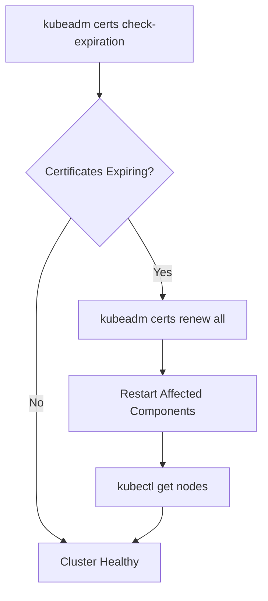

# Certificate Rotation

```mermaid
flowchart TD
    Check[kubeadm certs check-expiration]
    Expiring{Certificates Expiring?}
    Renew[kubeadm certs renew all]
    Restart[Restart Affected Components]
    Verify[kubectl get nodes]
    Healthy[Cluster Healthy]

    Check --> Expiring
    Expiring -->|Yes| Renew
    Expiring -->|No| Healthy
    Renew --> Restart
    Restart --> Verify
    Verify --> Healthy
```

## Key Point

Certificates should be checked regularly and renewed before expiration.
