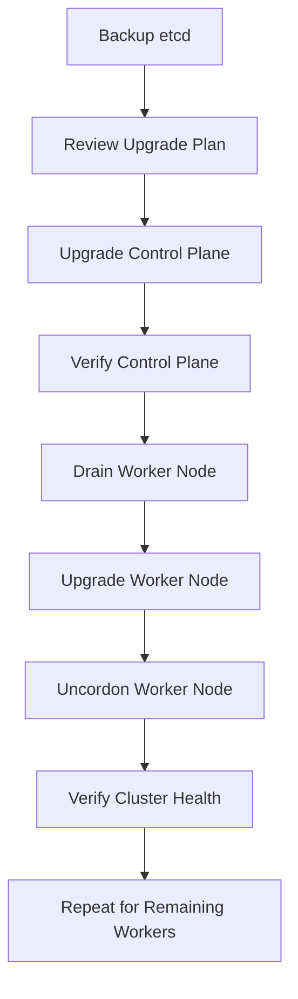

# Cluster Upgrade

```mermaid
flowchart TD
    Backup[Backup etcd]
    Plan[Review Upgrade Plan]
    ControlPlane[Upgrade Control Plane]
    VerifyCP[Verify Control Plane]
    Worker1[Drain Worker Node]
    UpgradeWorker[Upgrade Worker Node]
    Uncordon[Uncordon Worker Node]
    VerifyCluster[Verify Cluster Health]
    Repeat[Repeat for Remaining Workers]

    Backup --> Plan
    Plan --> ControlPlane
    ControlPlane --> VerifyCP
    VerifyCP --> Worker1
    Worker1 --> UpgradeWorker
    UpgradeWorker --> Uncordon
    Uncordon --> VerifyCluster
    VerifyCluster --> Repeat
```

## Key Point

Upgrade the control plane first, then upgrade worker nodes one at a time.
