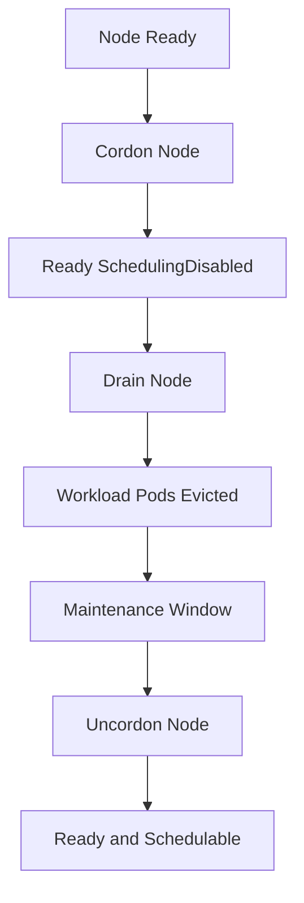

# Drain and Uncordon

```mermaid
flowchart TD
    Ready[Node Ready]
    Cordon[Cordon Node]
    SchedulingDisabled[Ready SchedulingDisabled]
    Drain[Drain Node]
    PodsEvicted[Workload Pods Evicted]
    Maintenance[Maintenance Window]
    Uncordon[Uncordon Node]
    ReadyAgain[Ready and Schedulable]

    Ready --> Cordon
    Cordon --> SchedulingDisabled
    SchedulingDisabled --> Drain
    Drain --> PodsEvicted
    PodsEvicted --> Maintenance
    Maintenance --> Uncordon
    Uncordon --> ReadyAgain
```

## Key Point

`drain` prepares the node for maintenance, while `uncordon` returns it to normal scheduling.
