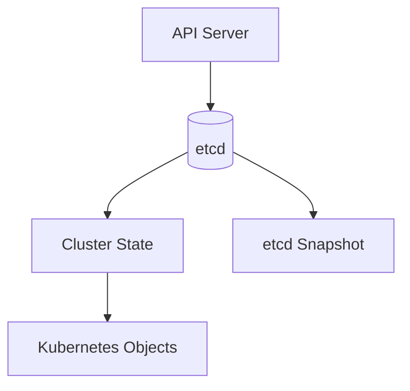

# etcd

```mermaid
flowchart TD
    APIServer[API Server]
    Etcd[(etcd)]
    State[Cluster State]
    Objects[Kubernetes Objects]
    Backup[etcd Snapshot]

    APIServer --> Etcd
    Etcd --> State
    State --> Objects
    Etcd --> Backup
```

## Key Point

etcd stores the complete Kubernetes cluster state and must be backed up regularly.
