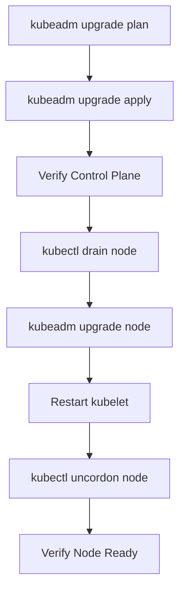

# kubeadm Upgrade

```mermaid
flowchart TD
    CheckPlan[kubeadm upgrade plan]
    ApplyUpgrade[kubeadm upgrade apply]
    VerifyCP[Verify Control Plane]
    DrainNode[kubectl drain node]
    UpgradeNode[kubeadm upgrade node]
    RestartKubelet[Restart kubelet]
    UncordonNode[kubectl uncordon node]
    VerifyNode[Verify Node Ready]

    CheckPlan --> ApplyUpgrade
    ApplyUpgrade --> VerifyCP
    VerifyCP --> DrainNode
    DrainNode --> UpgradeNode
    UpgradeNode --> RestartKubelet
    RestartKubelet --> UncordonNode
    UncordonNode --> VerifyNode
```

## Key Point

`kubeadm upgrade` should be performed in a controlled sequence with verification after each step.
