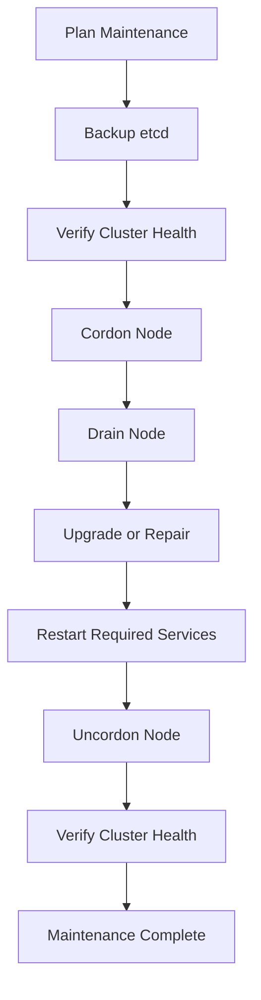

# Maintenance Workflow

```mermaid
flowchart TD
    Plan[Plan Maintenance]
    Backup[Backup etcd]
    HealthBefore[Verify Cluster Health]
    Cordon[Cordon Node]
    Drain[Drain Node]
    Maintain[Upgrade or Repair]
    Restart[Restart Required Services]
    Uncordon[Uncordon Node]
    HealthAfter[Verify Cluster Health]
    Complete[Maintenance Complete]

    Plan --> Backup
    Backup --> HealthBefore
    HealthBefore --> Cordon
    Cordon --> Drain
    Drain --> Maintain
    Maintain --> Restart
    Restart --> Uncordon
    Uncordon --> HealthAfter
    HealthAfter --> Complete
```

## Key Point

Safe maintenance follows a planned workflow: backup, isolate, maintain, restore scheduling, and verify health.
