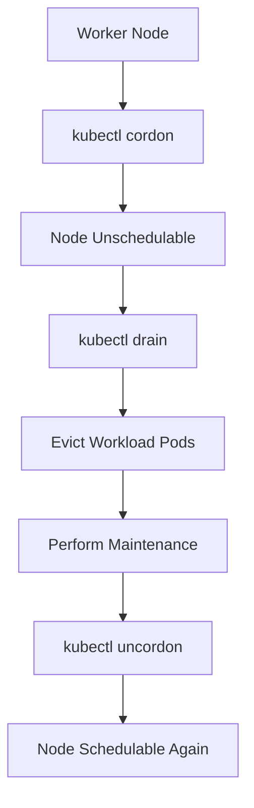

# Node Maintenance

```mermaid
flowchart TD
    Node[Worker Node]
    Cordon[kubectl cordon]
    Unschedulable[Node Unschedulable]
    Drain[kubectl drain]
    Evict[Evict Workload Pods]
    Maintenance[Perform Maintenance]
    Uncordon[kubectl uncordon]
    Schedulable[Node Schedulable Again]

    Node --> Cordon
    Cordon --> Unschedulable
    Unschedulable --> Drain
    Drain --> Evict
    Evict --> Maintenance
    Maintenance --> Uncordon
    Uncordon --> Schedulable
```

## Key Point

Node maintenance uses `cordon`, `drain`, and `uncordon` to safely remove and return nodes to service.
