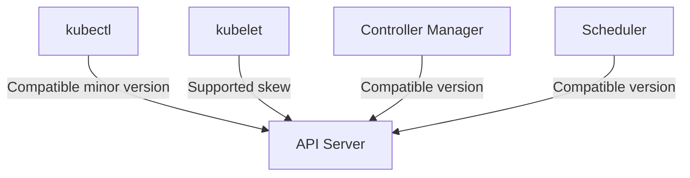

# Version Skew

```mermaid
flowchart TD
    APIServer[API Server]
    Kubectl[kubectl]
    Kubelet[kubelet]
    Controller[Controller Manager]
    Scheduler[Scheduler]

    Kubectl -->|Compatible minor version| APIServer
    Kubelet -->|Supported skew| APIServer
    Controller -->|Compatible version| APIServer
    Scheduler -->|Compatible version| APIServer
```

## Key Point

Kubernetes components must stay within the supported Version Skew Policy during upgrades.
