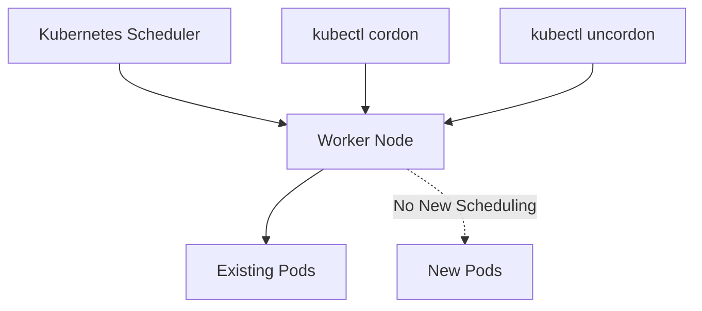

# Lab 01 - Cordon and Uncordon Nodes

## Difficulty

⭐⭐ Beginner

## Estimated Time

20–30 minutes

---

# CKA Objectives Covered

* Mark a node as unschedulable
* Verify node scheduling status
* Return a node to normal scheduling
* Observe scheduler behavior

---

# Objective

In this lab, you will:

* List cluster nodes.
* Cordon a worker node.
* Verify the node becomes unschedulable.
* Observe scheduling behavior.
* Uncordon the node.
* Verify scheduling resumes.

---

# Architecture



---

# What is Cordon?

A **cordoned** node is marked as **unschedulable**.

* Existing Pods continue running.
* No new Pods are scheduled.
* No workloads are evicted.

This is the first step before planned maintenance.

---

# Step 1 - View Cluster Nodes

```bash
kubectl get nodes
```

Example:

```text
NAME          STATUS   ROLES           AGE

control-plane Ready    control-plane   12d

worker-1      Ready    <none>          12d
```

---

# Step 2 - Cordon the Worker Node

Replace `<node-name>` with your worker node name.

```bash
kubectl cordon <node-name>
```

Example:

```bash
kubectl cordon worker-1
```

Expected:

```text
node/worker-1 cordoned
```

---

# Step 3 - Verify Node Status

```bash
kubectl get nodes
```

Expected:

```text
NAME          STATUS

worker-1      Ready,SchedulingDisabled
```

`SchedulingDisabled` confirms that the node has been cordoned.

---

# Step 4 - Describe the Node

```bash
kubectl describe node <node-name>
```

Look for:

```text
Unschedulable: true
```

This confirms the scheduler will not place new Pods on the node.

---

# Step 5 - Verify Existing Pods Continue Running

List Pods:

```bash
kubectl get pods -A -o wide
```

Notice:

* Existing Pods remain on the cordoned node.
* They are **not** evicted.

This is expected behavior.

---

# Step 6 - Observe Scheduling Behavior

Create a simple Deployment:

```bash
kubectl create deployment nginx-demo \
  --image=nginx:1.27 \
  --replicas=2
```

Check Pod placement:

```bash
kubectl get pods -o wide
```

Observe:

* New Pods are scheduled only on schedulable nodes.
* The cordoned node does not receive new Pods.

> If your lab has only one worker node, Pods may remain Pending because no schedulable worker is available.

---

# Step 7 - Uncordon the Node

Return the node to service:

```bash
kubectl uncordon <node-name>
```

Example:

```bash
kubectl uncordon worker-1
```

Expected:

```text
node/worker-1 uncordoned
```

---

# Step 8 - Verify Scheduling Resumes

```bash
kubectl get nodes
```

Expected:

```text
NAME          STATUS

worker-1      Ready
```

The `SchedulingDisabled` status is gone.

---

# Step 9 - Verify New Pods Can Be Scheduled

Scale the Deployment:

```bash
kubectl scale deployment nginx-demo --replicas=4
```

Verify Pod placement:

```bash
kubectl get pods -o wide
```

The scheduler can now place Pods on the previously cordoned node.

---

# Verification Checklist

✅ Node successfully cordoned.

✅ Node shows `Ready,SchedulingDisabled`.

✅ Existing Pods continue running.

✅ New Pods are not scheduled to the cordoned node.

✅ Node successfully uncordoned.

✅ Scheduler resumes normal operation.

---

# Common Errors

## Node Name Incorrect

Verify:

```bash
kubectl get nodes
```

Use the exact node name.

---

## Pods Still Running After Cordon

This is expected.

`cordon` **does not** evict existing Pods.

Use `drain` when workloads must be moved.

---

## Node Still Shows SchedulingDisabled

Run:

```bash
kubectl uncordon <node-name>
```

Verify:

```bash
kubectl get nodes
```

---

# Production Discussion

Typical maintenance sequence:

1. Cordon the node.
2. Drain application workloads.
3. Perform maintenance.
4. Verify node health.
5. Uncordon the node.

Never reboot or upgrade a busy node without first preventing new workloads from being scheduled.

---

# Real World Notes

Typical reasons to cordon a node:

* Operating system updates
* Hardware replacement
* Kubernetes upgrades
* Security patching
* Disk maintenance
* Network maintenance

---

# Knowledge Check

1. What does `kubectl cordon` do?
2. Are existing Pods removed after cordoning?
3. What status indicates a node is unschedulable?
4. Which command allows scheduling again?
5. What is the difference between `cordon` and `drain`?

---

# Cleanup

Delete the test Deployment:

```bash
kubectl delete deployment nginx-demo
```

If the node is still cordoned:

```bash
kubectl uncordon <node-name>
```

---

# Challenge

1. Cordon a worker node.
2. Verify it reports `Ready,SchedulingDisabled`.
3. Create a Deployment with three replicas.
4. Observe where the Pods are scheduled.
5. Uncordon the node.
6. Scale the Deployment and verify the node can receive new Pods again.
7. Explain why `cordon` is always performed before `drain` during planned maintenance.
