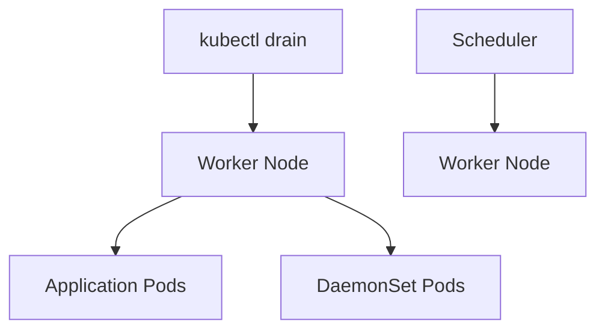

# Lab 02 - Drain a Node

## Difficulty

⭐⭐⭐ Intermediate

## Estimated Time

30–40 minutes

---

# CKA Objectives Covered

* Drain a worker node
* Understand Pod eviction
* Understand DaemonSet behavior
* Handle emptyDir volumes
* Prepare a node for maintenance

---

# Objective

In this lab, you will:

* Create a Deployment.
* Drain a worker node.
* Observe Pod rescheduling.
* Verify DaemonSet behavior.
* Return the node to service.

---

# Architecture



---

# What is Drain?

`kubectl drain` prepares a node for maintenance by:

* Marking the node unschedulable.
* Evicting application Pods.
* Leaving DaemonSet Pods running by default.
* Allowing workloads to move to healthy nodes.

Unlike `cordon`, **drain moves workloads**.

---

# Step 1 - Verify Cluster Nodes

```bash
kubectl get nodes
```

Ensure at least one worker node is available.

---

# Step 2 - Create a Test Deployment

```bash
kubectl create deployment nginx-demo \
--image=nginx:1.27 \
--replicas=4
```

Verify:

```bash
kubectl get pods -o wide
```

Observe which node each Pod is running on.

---

# Step 3 - Drain the Worker Node

Replace `<node-name>` with your worker node.

```bash
kubectl drain <node-name> \
--ignore-daemonsets
```

Example:

```bash
kubectl drain worker-1 \
--ignore-daemonsets
```

Expected:

```text
node/worker-1 drained
```

---

# Step 4 - Verify Node Status

```bash
kubectl get nodes
```

Expected:

```text
Ready,SchedulingDisabled
```

---

# Step 5 - Verify Pod Rescheduling

```bash
kubectl get pods -o wide
```

Observe:

* Application Pods are recreated.
* Scheduler places them on other available nodes.
* Pod names change because new Pods are created.

---

# Step 6 - Verify DaemonSet Pods

List DaemonSets:

```bash
kubectl get daemonsets -A
```

View Pods:

```bash
kubectl get pods -A -o wide
```

Notice:

* DaemonSet Pods remain on the drained node.
* This is expected behavior.

---

# Step 7 - Drain a Node with emptyDir Volumes

If a Pod uses an `emptyDir` volume, Kubernetes protects it by default.

Attempting to drain may display an error similar to:

```text
cannot delete Pods with local storage
```

Drain again:

```bash
kubectl drain <node-name> \
--ignore-daemonsets \
--delete-emptydir-data
```

> Use `--delete-emptydir-data` only when you understand that `emptyDir` data is temporary and will be lost.

---

# Step 8 - Return the Node to Service

```bash
kubectl uncordon <node-name>
```

Verify:

```bash
kubectl get nodes
```

Expected:

```text
Ready
```

---

# Step 9 - Scale the Deployment

```bash
kubectl scale deployment nginx-demo \
--replicas=6
```

Verify:

```bash
kubectl get pods -o wide
```

The scheduler may now place new Pods on the restored node.

---

# Verification Checklist

✅ Node drained successfully.

✅ Application Pods rescheduled.

✅ DaemonSet Pods remained.

✅ Node uncordoned.

✅ Scheduler resumed normal scheduling.

---

# Common Errors

## Drain Hangs

Possible causes:

* PodDisruptionBudget
* Long termination grace period
* Unmanaged Pods

Investigate:

```bash
kubectl get pdb -A

kubectl get pods -A
```

---

## Cannot Delete Pods with Local Storage

Use:

```bash
kubectl drain <node-name> \
--ignore-daemonsets \
--delete-emptydir-data
```

Only if data loss is acceptable.

---

## DaemonSet Pods Still Running

This is expected.

`kubectl drain` ignores DaemonSet Pods unless you manually remove them.

---

## Node Still SchedulingDisabled

Run:

```bash
kubectl uncordon <node-name>
```

---

# Production Discussion

A safe maintenance workflow:

```text
Cordon

↓

Drain

↓

Upgrade / Repair

↓

Restart kubelet

↓

Verify Health

↓

Uncordon
```

Never perform maintenance on a busy node without draining workloads first.

---

# Real World Notes

Drain is commonly used for:

* Kubernetes upgrades
* Operating system patching
* Hardware replacement
* Kernel upgrades
* Cloud instance maintenance
* Security patch deployment

---

# Knowledge Check

1. What is the purpose of `kubectl drain`?
2. What is the difference between `cordon` and `drain`?
3. Why are DaemonSet Pods not removed by default?
4. When should `--delete-emptydir-data` be used?
5. Why is `uncordon` required after maintenance?

---

# Cleanup

Delete the Deployment:

```bash
kubectl delete deployment nginx-demo
```

Ensure the node is schedulable:

```bash
kubectl uncordon <node-name>
```

---

# Challenge

1. Create a Deployment with five replicas.
2. Drain a worker node.
3. Observe Pod rescheduling.
4. Verify DaemonSet Pods remain.
5. Return the node to service.
6. Scale the Deployment and verify new Pods can be scheduled on the restored node.
7. Explain why draining a node is safer than simply rebooting it.
