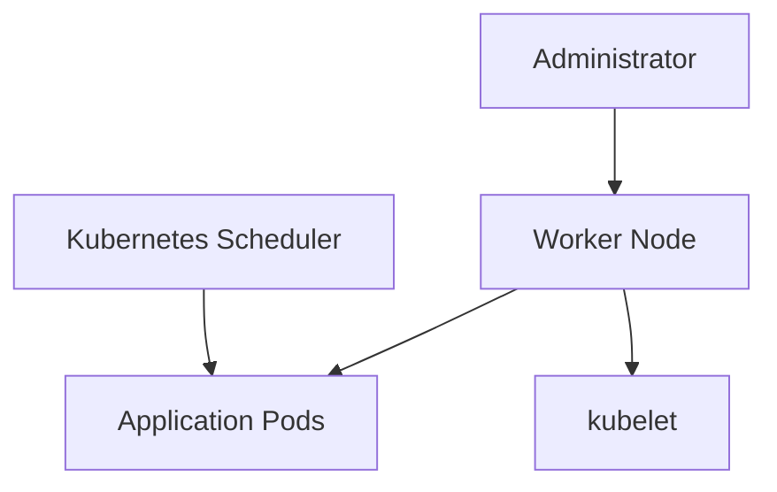

# Lab 03 - Node Maintenance

## Difficulty

⭐⭐⭐⭐ Intermediate

## Estimated Time

40–50 minutes

---

# CKA Objectives Covered

* Perform complete node maintenance
* Cordon and drain a node
* Restart kubelet
* Verify node health
* Return the node to service
* Validate workload availability

---

# Objective

In this lab, you will:

* Simulate a production maintenance window.
* Prevent new Pods from scheduling.
* Safely evacuate workloads.
* Restart the kubelet service.
* Verify cluster health.
* Return the node to production.

---

# Architecture



---

# Maintenance Workflow

```text
Verify Cluster

↓

Cordon Node

↓

Drain Node

↓

Restart kubelet

↓

Verify Node

↓

Uncordon Node

↓

Verify Cluster
```

---

# Step 1 - Verify Cluster Health

Check cluster status:

```bash
kubectl get nodes

kubectl get pods -A
```

Ensure:

* All nodes are **Ready**
* No application Pods are failing

---

# Step 2 - Create a Test Deployment

```bash
kubectl create deployment nginx-demo \
--image=nginx:1.27 \
--replicas=5
```

Verify:

```bash
kubectl get pods -o wide
```

Observe which node each Pod is running on.

---

# Step 3 - Cordon the Worker Node

```bash
kubectl cordon <node-name>
```

Verify:

```bash
kubectl get nodes
```

Expected:

```text
Ready,SchedulingDisabled
```

---

# Step 4 - Drain the Worker Node

```bash
kubectl drain <node-name> \
--ignore-daemonsets
```

If required:

```bash
kubectl drain <node-name> \
--ignore-daemonsets \
--delete-emptydir-data
```

---

# Step 5 - Verify Pod Eviction

```bash
kubectl get pods -o wide
```

Observe:

* Pods have been recreated.
* Scheduler moved them to other nodes.
* DaemonSet Pods remain.

---

# Step 6 - Restart kubelet

On the worker node:

```bash
sudo systemctl restart kubelet
```

Verify:

```bash
sudo systemctl status kubelet
```

Expected:

```text
Active: active (running)
```

---

# Step 7 - Verify Node Health

From your management workstation:

```bash
kubectl get nodes
```

Describe the node:

```bash
kubectl describe node <node-name>
```

Confirm:

* Node is **Ready**
* No critical conditions
* kubelet is reporting normally

---

# Step 8 - Verify kube-system Pods

```bash
kubectl get pods -n kube-system
```

Ensure critical components remain healthy.

Examples:

* CoreDNS
* kube-proxy
* CNI plugin

---

# Step 9 - Uncordon the Node

```bash
kubectl uncordon <node-name>
```

Verify:

```bash
kubectl get nodes
```

Expected:

```text
Ready
```

---

# Step 10 - Verify Scheduling

Scale the Deployment:

```bash
kubectl scale deployment nginx-demo \
--replicas=8
```

Check placement:

```bash
kubectl get pods -o wide
```

New Pods can now be scheduled onto the restored node.

---

# Step 11 - Final Cluster Verification

Run:

```bash
kubectl cluster-info

kubectl get nodes

kubectl get pods -A

kubectl get events --sort-by=.lastTimestamp
```

Ensure:

* API Server is reachable.
* Nodes are Ready.
* Application Pods are healthy.
* No unexpected warning events.

---

# Verification Checklist

✅ Cluster verified before maintenance.

✅ Node cordoned.

✅ Node drained.

✅ kubelet restarted.

✅ Node healthy.

✅ Node uncordoned.

✅ Applications healthy.

---

# Common Errors

## Drain Never Completes

Check:

```bash
kubectl get pdb -A
```

Possible causes:

* PodDisruptionBudget
* Long termination grace period
* Unmanaged Pods

---

## kubelet Does Not Start

Check:

```bash
systemctl status kubelet

journalctl -u kubelet -n 100
```

---

## Node Remains NotReady

Verify:

* kubelet running
* Container runtime healthy
* Network connectivity
* Node events

---

## Pods Not Rescheduled

Investigate:

```bash
kubectl describe pod <pod-name>

kubectl get events
```

Possible causes:

* Insufficient resources
* Node selectors
* Taints
* Affinity rules

---

# Production Discussion

A safe production maintenance window follows this sequence:

```text
Verify Health

↓

Backup etcd

↓

Cordon

↓

Drain

↓

Maintenance

↓

Restart Services

↓

Health Verification

↓

Uncordon

↓

Final Verification
```

Skipping verification at any stage increases operational risk.

---

# Real World Notes

Common maintenance activities include:

* Operating system updates
* Kubernetes upgrades
* Security patches
* Kernel updates
* Hardware replacement
* Cloud instance maintenance
* Disk replacement

The process remains the same regardless of the maintenance task.

---

# Knowledge Check

1. Why is `cordon` performed before `drain`?
2. Why should kubelet status be verified after restarting?
3. Why are DaemonSet Pods left running?
4. Why is health verification required before uncordoning?
5. What commands would you use to confirm the cluster is healthy after maintenance?

---

# Cleanup

Delete the Deployment:

```bash
kubectl delete deployment nginx-demo
```

Ensure the node is schedulable:

```bash
kubectl uncordon <node-name>
```

---

# Challenge

Perform a complete maintenance workflow on a worker node:

1. Verify cluster health.
2. Cordon the node.
3. Drain the node.
4. Restart kubelet.
5. Verify kubelet and node health.
6. Verify `kube-system` Pods.
7. Uncordon the node.
8. Scale a Deployment and confirm workloads can again be scheduled to the node.
9. Document every command used during the maintenance process.
