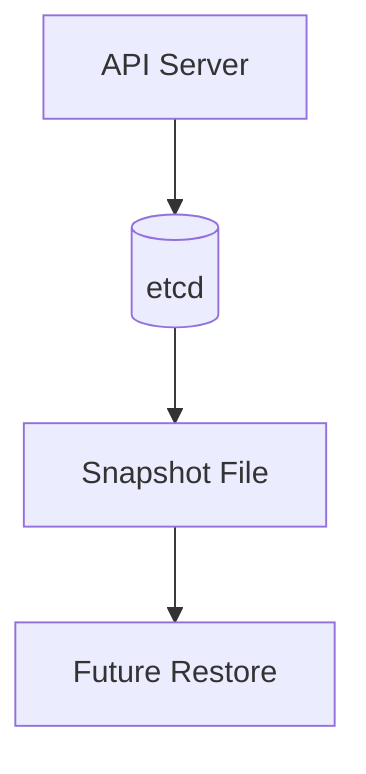

# Lab 04 - etcd Backup

## Difficulty

⭐⭐⭐⭐ Intermediate

## Estimated Time

30–40 minutes

---

# CKA Objectives Covered

* Identify the etcd datastore
* Create an etcd snapshot
* Verify snapshot integrity
* Understand disaster recovery preparation

---

# Objective

In this lab, you will:

* Locate the etcd configuration.
* Create an etcd snapshot.
* Verify the backup.
* Understand when backups should be performed.
* Prepare for disaster recovery.

---

# Architecture



---

# What is etcd?

etcd is Kubernetes' distributed key-value database.

It stores:

* Pods
* Deployments
* Services
* Secrets
* ConfigMaps
* RBAC
* PersistentVolumes
* Namespaces
* Cluster configuration

If etcd is lost, Kubernetes loses its cluster state.

---

# Step 1 - Verify etcd is Running

On the control plane node:

```bash
kubectl get pods -n kube-system
```

Locate the etcd Pod.

Example:

```text
etcd-control-plane
```

---

# Step 2 - Inspect the etcd Static Pod

```bash
kubectl describe pod etcd-<control-plane-node> \
-n kube-system
```

Observe:

* Client URLs
* Certificate paths
* Data directory

These values are needed for backup and restore operations.

---

# Step 3 - Locate Certificate Files

Typical kubeadm locations:

```text
/etc/kubernetes/pki/etcd/ca.crt

/etc/kubernetes/pki/etcd/server.crt

/etc/kubernetes/pki/etcd/server.key
```

Verify:

```bash
ls -l /etc/kubernetes/pki/etcd
```

---

# Step 4 - Create the Snapshot

Run:

```bash
sudo ETCDCTL_API=3 etcdctl snapshot save /opt/etcd-snapshot.db \
  --endpoints=https://127.0.0.1:2379 \
  --cacert=/etc/kubernetes/pki/etcd/ca.crt \
  --cert=/etc/kubernetes/pki/etcd/server.crt \
  --key=/etc/kubernetes/pki/etcd/server.key
```

Expected:

```text
Snapshot saved at /opt/etcd-snapshot.db
```

> Your certificate paths or endpoint may differ slightly depending on the cluster configuration.

---

# Step 5 - Verify the Snapshot Exists

```bash
ls -lh /opt/etcd-snapshot.db
```

Confirm:

* File exists.
* File size is reasonable (not zero bytes).

---

# Step 6 - Verify Snapshot Integrity

```bash
sudo ETCDCTL_API=3 etcdctl snapshot status \
/opt/etcd-snapshot.db \
-w table
```

Example:

```text
+----------+----------+------------+------------+
| HASH     | REVISION | TOTAL KEYS | TOTAL SIZE |
+----------+----------+------------+------------+
```

This confirms the snapshot is valid.

---

# Step 7 - Compare Cluster State

Verify the cluster is healthy:

```bash
kubectl get nodes

kubectl get pods -A
```

Remember:

The snapshot captures the cluster state at the moment it was created.

Changes made after the backup will not be included.

---

# Step 8 - When Should You Back Up etcd?

Always create a backup before:

* Kubernetes upgrades
* Certificate renewal
* Control plane maintenance
* Major configuration changes
* Disaster recovery testing

Many organizations also schedule regular automated etcd backups.

---

# Verification Checklist

✅ etcd Pod identified.

✅ Certificate locations verified.

✅ Snapshot created.

✅ Snapshot integrity verified.

✅ Cluster health confirmed.

---

# Common Errors

## Connection Refused

Example:

```text
connection refused
```

Check:

* etcd is running.
* Correct endpoint (`127.0.0.1:2379` by default on kubeadm).
* Firewall or network configuration.

---

## Permission Denied

Ensure:

* Correct certificate paths.
* Sufficient privileges (`sudo` may be required).

---

## Snapshot File Not Created

Verify:

* Output path exists.
* Sufficient disk space.
* Write permissions.

---

# Production Discussion

Best practices:

* Automate etcd backups.
* Store backups off the control plane node.
* Encrypt backups at rest.
* Periodically test restore procedures.
* Monitor backup success.

A backup that has never been tested is not a reliable backup.

---

# Real World Notes

Common backup destinations include:

* Network-attached storage
* Object storage (for example, S3-compatible storage)
* Backup appliances
* Secure off-site storage

Protect etcd snapshots because they may contain sensitive information such as Secrets.

---

# Knowledge Check

1. What does etcd store?
2. Why is an etcd backup critical?
3. Which tool creates etcd snapshots?
4. How do you verify a snapshot?
5. Why should restore procedures be tested regularly?

---

# Cleanup

The snapshot can be retained for later restore labs.

If you want to remove it:

```bash
sudo rm -f /opt/etcd-snapshot.db
```

---

# Challenge

1. Locate the etcd Pod.
2. Identify:

   * Client endpoint
   * Certificate paths
   * Data directory
3. Create a snapshot named:

```text
/opt/cluster-backup.db
```

4. Verify the snapshot using:

```bash
ETCDCTL_API=3 etcdctl snapshot status \
/opt/cluster-backup.db -w table
```

5. Explain why this backup should always be taken before a Kubernetes control plane upgrade.
