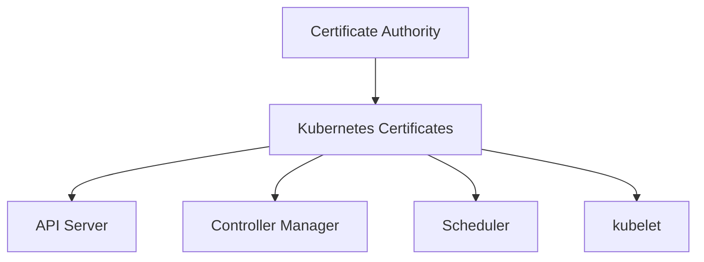

# Lab 06 - Certificate Rotation

## Difficulty

⭐⭐⭐⭐ Intermediate

## Estimated Time

30–40 minutes

---

# CKA Objectives Covered

* Check certificate expiration
* Renew Kubernetes certificates
* Restart affected components
* Verify certificate health
* Understand certificate lifecycle

---

# Objective

In this lab, you will:

* Inspect certificate expiration dates.
* Renew Kubernetes certificates.
* Verify the renewed certificates.
* Understand when component restarts are required.
* Validate cluster health after renewal.

---

# Architecture



---

# What are Kubernetes Certificates?

Kubernetes uses TLS certificates to authenticate and encrypt communication between components such as:

* API Server
* etcd
* kubelet
* Scheduler
* Controller Manager
* kubectl

Certificates have expiration dates and must be renewed before they expire.

---

# Step 1 - Check Certificate Expiration

Run:

```bash id="o2h7yf"
sudo kubeadm certs check-expiration
```

Example output:

```text id="rnj19e"
CERTIFICATE                EXPIRES                  RESIDUAL TIME

admin.conf                 ...

apiserver                  ...

etcd-server                ...
```

Review:

* Expiration date
* Remaining validity

---

# Step 2 - Identify Expiring Certificates

Look for certificates with a short remaining lifetime.

Common certificates include:

* apiserver
* apiserver-kubelet-client
* front-proxy-client
* etcd-server
* admin.conf

---

# Step 3 - Renew All Certificates

```bash id="mjlwm1"
sudo kubeadm certs renew all
```

Expected:

```text id="jlwm2"
certificate renewed successfully
```

---

# Step 4 - Renew a Single Certificate (Optional)

Example:

```bash id="jlwm3"
sudo kubeadm certs renew apiserver
```

You can renew individual certificates if needed.

---

# Step 5 - Verify Renewal

Run:

```bash id="jlwm4"
sudo kubeadm certs check-expiration
```

Confirm the expiration dates have been extended.

---

# Step 6 - Restart kubelet

Restart kubelet to ensure components reload updated certificates when appropriate:

```bash id="jlwm5"
sudo systemctl restart kubelet
```

Verify:

```bash id="jlwm6"
systemctl status kubelet
```

Expected:

```text id="jlwm7"
Active: active (running)
```

> On kubeadm clusters, updating static Pod manifests or restarting kubelet allows control plane Pods to be recreated with the renewed certificates if necessary.

---

# Step 7 - Verify Control Plane Health

```bash id="jlwm8"
kubectl get pods -n kube-system
```

Ensure components such as:

* etcd
* kube-apiserver
* kube-controller-manager
* kube-scheduler

are healthy.

---

# Step 8 - Verify Cluster Health

```bash id="jlwm9"
kubectl get nodes

kubectl cluster-info

kubectl get pods -A
```

Confirm:

* Nodes are `Ready`.
* API Server is reachable.
* Workloads are healthy.

---

# Verification Checklist

✅ Certificate expiration checked.

✅ Certificates renewed.

✅ kubelet restarted.

✅ Control plane healthy.

✅ Cluster operational.

---

# Common Errors

## kubeadm Command Not Found

Verify that the cluster was installed using **kubeadm**.

Managed Kubernetes services typically do not expose `kubeadm`.

---

## Certificates Still Show Old Dates

Check:

```bash id="jlwm10"
sudo kubeadm certs check-expiration
```

If required:

* Ensure the renewal command completed successfully.
* Restart kubelet so updated certificates are used where applicable.

---

## API Server Not Reachable

Verify:

```bash id="jlwm11"
kubectl cluster-info
```

Review:

* kube-apiserver static Pod
* kubelet status
* kube-system Pods

---

## Control Plane Pods Restarting

Temporary restarts can occur while components reload updated certificates.

Verify:

```bash id="jlwm12"
kubectl get pods -n kube-system
```

Wait until all Pods are healthy.

---

# Production Discussion

Best practices:

* Monitor certificate expiration.
* Renew certificates before expiration.
* Schedule certificate maintenance during maintenance windows.
* Verify cluster health after renewal.
* Keep CA private keys secure.
* Document renewal procedures.

---

# Real World Notes

Managed Kubernetes platforms automatically rotate many control plane certificates.

For self-managed kubeadm clusters, administrators are responsible for monitoring and renewing certificates.

---

# Knowledge Check

1. Why are Kubernetes certificates required?
2. Which command checks certificate expiration?
3. Which command renews all certificates?
4. Why should cluster health be verified after renewal?
5. Why is kubelet commonly restarted after certificate maintenance?

---

# Cleanup

No cleanup is required.

This lab performs standard maintenance operations on the cluster.

---

# Challenge

1. Check certificate expiration.
2. Identify the certificate that expires first.
3. Renew all certificates.
4. Restart kubelet.
5. Verify:

```bash id="jlwm13"
kubectl get nodes

kubectl get pods -n kube-system
```

6. Explain why renewing certificates before expiration is safer than waiting until they expire.
