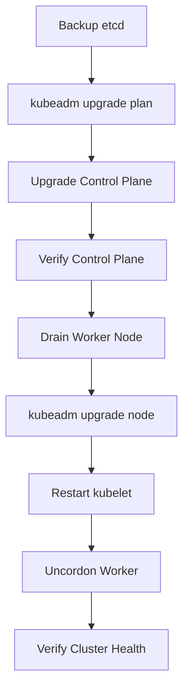

# Lab 07 - kubeadm Upgrade

## Difficulty

⭐⭐⭐⭐⭐ Advanced

## Estimated Time

45–60 minutes

---

# CKA Objectives Covered

* Review a Kubernetes upgrade plan
* Upgrade the control plane
* Upgrade worker nodes
* Restart kubelet
* Verify cluster health after upgrade

---

# Objective

In this lab, you will:

* Review the upgrade plan.
* Upgrade the control plane.
* Upgrade a worker node.
* Verify cluster health.
* Understand the recommended upgrade sequence.

---

# Architecture



---

# Prerequisites

Before upgrading:

* Create an etcd backup.
* Verify all nodes are `Ready`.
* Ensure workloads are healthy.
* Review Kubernetes release notes.

---

# Step 1 - Verify Cluster Health

```bash
kubectl get nodes

kubectl get pods -A

kubectl cluster-info
```

The cluster should be healthy before beginning the upgrade.

---

# Step 2 - Review the Upgrade Plan

On the control plane node:

```bash
sudo kubeadm upgrade plan
```

Example:

```text
Components that can be upgraded:

Current Version

Target Version
```

Review:

* Current version
* Available versions
* Upgrade path

---

# Step 3 - Upgrade the Control Plane

Replace `<version>` with the target version.

Example:

```bash
sudo kubeadm upgrade apply v1.34.x
```

Follow the prompts.

Expected:

```text
SUCCESS!
```

> Use the version recommended by `kubeadm upgrade plan`.

---

# Step 4 - Verify the Control Plane

```bash
kubectl get nodes

kubectl get pods -n kube-system
```

Verify:

* API Server
* Controller Manager
* Scheduler
* etcd

are healthy.

---

# Step 5 - Prepare the Worker Node

Drain the worker node:

```bash
kubectl drain <worker-node> \
--ignore-daemonsets
```

If necessary:

```bash
kubectl drain <worker-node> \
--ignore-daemonsets \
--delete-emptydir-data
```

---

# Step 6 - Upgrade the Worker Node

On the worker node:

```bash
sudo kubeadm upgrade node
```

This updates the node configuration.

---

# Step 7 - Restart kubelet

```bash
sudo systemctl restart kubelet
```

Verify:

```bash
systemctl status kubelet
```

Expected:

```text
Active: active (running)
```

---

# Step 8 - Return the Node to Service

```bash
kubectl uncordon <worker-node>
```

Verify:

```bash
kubectl get nodes
```

The node should report:

```text
Ready
```

---

# Step 9 - Verify the Cluster

Run:

```bash
kubectl get nodes

kubectl get pods -A

kubectl get pods -n kube-system

kubectl get events --sort-by=.lastTimestamp
```

Ensure:

* Nodes are Ready.
* Control plane Pods are healthy.
* Applications are running normally.
* No critical events are reported.

---

# Upgrade Sequence

```text
Backup etcd

↓

Upgrade Control Plane

↓

Verify Control Plane

↓

Drain Worker

↓

Upgrade Worker

↓

Restart kubelet

↓

Uncordon Worker

↓

Verify Cluster
```

Never upgrade worker nodes before the control plane.

---

# Verification Checklist

✅ Upgrade plan reviewed.

✅ Control plane upgraded.

✅ Worker node drained.

✅ Worker node upgraded.

✅ kubelet restarted.

✅ Node uncordoned.

✅ Cluster healthy.

---

# Common Errors

## Upgrade Plan Fails

Check:

```bash
sudo kubeadm upgrade plan
```

Verify:

* Cluster is healthy.
* Internet access (if required).
* Supported upgrade path.

---

## Worker Node Not Ready

Verify:

```bash
systemctl status kubelet

kubectl get nodes
```

Review:

```bash
journalctl -u kubelet -n 100
```

---

## Pods Stuck Pending

Check:

```bash
kubectl get events

kubectl describe pod <pod-name>
```

Possible causes:

* Node still cordoned.
* Resource constraints.
* Scheduling rules.

---

## kube-system Pods Not Healthy

Review:

```bash
kubectl get pods -n kube-system

kubectl describe pod <pod-name> -n kube-system
```

---

# Production Discussion

Best practices:

* Back up etcd before upgrades.
* Upgrade one minor version at a time.
* Upgrade the control plane first.
* Upgrade one worker node at a time.
* Verify cluster health after each step.
* Schedule upgrades during maintenance windows.
* Test upgrades in a staging environment before production.

---

# Real World Notes

A production upgrade often includes:

* Maintenance notification
* etcd backup
* Health verification
* Rolling worker node upgrades
* Application validation
* Rollback plan if required

---

# Knowledge Check

1. Why is `kubeadm upgrade plan` important?
2. Why must the control plane be upgraded first?
3. Why should worker nodes be upgraded one at a time?
4. Why is kubelet restarted after upgrading a node?
5. What checks should be performed after the upgrade?

---

# Cleanup

No cleanup is required.

The cluster remains on the upgraded version.

---

# Challenge

1. Run:

```bash
sudo kubeadm upgrade plan
```

2. Identify the recommended target version.

3. Upgrade the control plane.

4. Drain a worker node.

5. Upgrade the worker node.

6. Restart kubelet.

7. Uncordon the node.

8. Verify:

```bash
kubectl get nodes

kubectl get pods -A

kubectl cluster-info
```

9. Explain why verifying the cluster after each upgraded node reduces operational risk.
