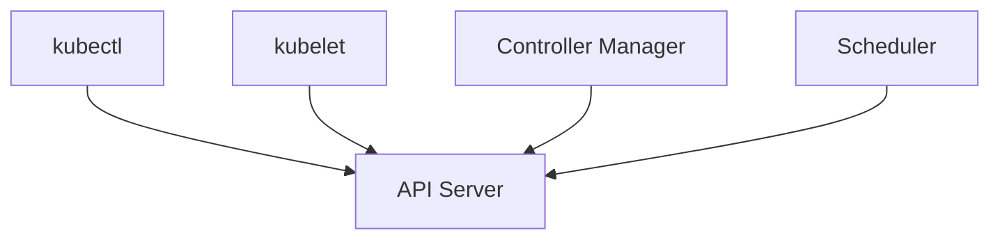

# Lab 08 - Version Skew

## Difficulty

⭐⭐⭐ Intermediate

## Estimated Time

20–30 minutes

---

# CKA Objectives Covered

* Understand Kubernetes Version Skew Policy
* Verify cluster component versions
* Identify supported version combinations
* Plan safe Kubernetes upgrades

---

# Objective

In this lab, you will:

* Check the versions of Kubernetes components.
* Understand the Version Skew Policy.
* Verify compatibility between components.
* Plan a safe upgrade path.

---

# Architecture



---

# What is Version Skew?

Version Skew defines the supported version differences between Kubernetes components.

Following the Version Skew Policy ensures:

* Stable upgrades
* Component compatibility
* Reduced operational risk

---

# Step 1 - Check Client and Server Versions

Run:

```bash
kubectl version
```

Example:

```text
Client Version: v1.34.x

Server Version: v1.34.x
```

---

# Step 2 - Check Node Versions

```bash
kubectl get nodes
```

Example:

```text
NAME             VERSION

control-plane    v1.34.x

worker-1         v1.34.x
```

---

# Step 3 - View Detailed Node Information

```bash
kubectl describe node <node-name>
```

Review:

* kubelet version
* Operating System
* Container Runtime

---

# Step 4 - Understand Supported Version Skew

General guidelines:

| Component                | Typical Supported Version Difference                |
| ------------------------ | --------------------------------------------------- |
| kubectl ↔ API Server     | Within one minor version                            |
| kubelet ↔ API Server     | Within the supported Kubernetes Version Skew Policy |
| Control Plane Components | Same Kubernetes minor version                       |

> Always verify compatibility against the official Kubernetes Version Skew Policy for the Kubernetes release you are running.

---

# Step 5 - Upgrade Planning Example

Current cluster:

```text
Control Plane

v1.33.x

Worker Nodes

v1.33.x
```

Target:

```text
Control Plane

↓

v1.34.x

↓

Worker Nodes

↓

v1.34.x
```

Never skip unsupported upgrade paths.

---

# Step 6 - Verify Cluster Health

```bash
kubectl get nodes

kubectl get pods -A

kubectl cluster-info
```

Confirm:

* Nodes are Ready.
* API Server is reachable.
* Workloads are healthy.

---

# Verification Checklist

✅ Client version checked.

✅ Server version checked.

✅ Node versions verified.

✅ Upgrade path understood.

✅ Cluster healthy.

---

# Common Errors

## kubectl Version Too Old

Symptoms:

Unexpected command behavior or unsupported features.

Verify:

```bash
kubectl version --client
```

Upgrade `kubectl` if necessary.

---

## Worker Version Mismatch

Verify:

```bash
kubectl get nodes
```

Ensure worker nodes remain within the supported version skew of the API Server.

---

## Unsupported Upgrade Path

Review:

```bash
kubeadm upgrade plan
```

Do not skip unsupported Kubernetes minor versions.

---

# Production Discussion

Best practices:

* Upgrade one minor version at a time.
* Upgrade the control plane before worker nodes.
* Upgrade one worker node at a time.
* Verify cluster health after each upgrade.
* Follow the official Version Skew Policy.

---

# Real World Notes

Many production incidents occur because:

* Nodes run unsupported versions.
* `kubectl` is significantly newer or older than the cluster.
* Upgrade procedures skip supported upgrade paths.

Proper planning avoids these problems.

---

# Knowledge Check

1. What is Version Skew?
2. Why should the control plane be upgraded first?
3. How do you check Kubernetes versions?
4. Why should unsupported upgrade paths be avoided?
5. Why is `kubeadm upgrade plan` useful?

---

# Cleanup

No cleanup is required.

This lab is read-only and does not modify the cluster.

---

# Challenge

1. Check:

```bash
kubectl version

kubectl get nodes
```

2. Record:

* Client version
* Server version
* Node versions

3. Determine whether your cluster components appear compatible.

4. Explain why upgrading one minor version at a time is safer than skipping multiple releases.

5. Describe the recommended upgrade order for a kubeadm cluster.
