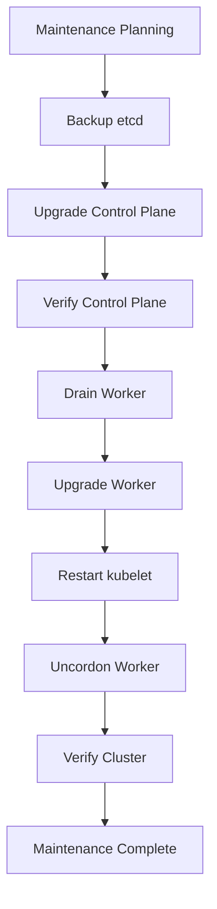

# Lab 09 - Cluster Upgrade

## Difficulty

⭐⭐⭐⭐⭐ Advanced

## Estimated Time

60–90 minutes

---

# CKA Objectives Covered

* Plan a cluster upgrade
* Back up etcd
* Upgrade the control plane
* Upgrade worker nodes
* Verify certificates
* Validate cluster health

---

# Objective

In this lab, you will perform a complete Kubernetes cluster upgrade using the recommended production workflow.

---

# Architecture



---

# Scenario

You are the Kubernetes administrator for a production cluster.

A maintenance window has been approved.

Your goal is to upgrade the cluster while minimizing application downtime.

---

# Step 1 - Verify Cluster Health

```bash
kubectl get nodes

kubectl get pods -A

kubectl cluster-info

kubectl get events --sort-by=.lastTimestamp
```

Confirm:

* Nodes are Ready
* Applications are healthy
* No unexpected warning events

---

# Step 2 - Create an etcd Backup

```bash
sudo ETCDCTL_API=3 etcdctl snapshot save /opt/pre-upgrade.db \
  --endpoints=https://127.0.0.1:2379 \
  --cacert=/etc/kubernetes/pki/etcd/ca.crt \
  --cert=/etc/kubernetes/pki/etcd/server.crt \
  --key=/etc/kubernetes/pki/etcd/server.key
```

Verify:

```bash
sudo ETCDCTL_API=3 etcdctl snapshot status \
/opt/pre-upgrade.db -w table
```

---

# Step 3 - Review the Upgrade Plan

```bash
sudo kubeadm upgrade plan
```

Review:

* Current version
* Target version
* Upgrade recommendations

---

# Step 4 - Upgrade the Control Plane

```bash
sudo kubeadm upgrade apply <target-version>
```

Example:

```bash
sudo kubeadm upgrade apply v1.34.x
```

---

# Step 5 - Verify the Control Plane

```bash
kubectl get nodes

kubectl get pods -n kube-system
```

Ensure:

* kube-apiserver
* kube-controller-manager
* kube-scheduler
* etcd

are healthy.

---

# Step 6 - Upgrade a Worker Node

Drain the worker:

```bash
kubectl drain <worker-node> \
--ignore-daemonsets
```

Upgrade node configuration:

```bash
sudo kubeadm upgrade node
```

Restart kubelet:

```bash
sudo systemctl restart kubelet
```

Return the node to service:

```bash
kubectl uncordon <worker-node>
```

Repeat these steps for each remaining worker node.

---

# Step 7 - Verify Certificates

Check expiration:

```bash
sudo kubeadm certs check-expiration
```

If certificates require renewal:

```bash
sudo kubeadm certs renew all
```

Restart kubelet if appropriate:

```bash
sudo systemctl restart kubelet
```

---

# Step 8 - Final Cluster Verification

Run:

```bash
kubectl get nodes

kubectl get pods -A

kubectl get pods -n kube-system

kubectl cluster-info

kubectl get events --sort-by=.lastTimestamp
```

Confirm:

* Nodes are Ready.
* Control plane components are healthy.
* Workloads are running normally.
* No critical warning events.

---

# Production Upgrade Checklist

```text
✔ Maintenance approved

✔ etcd backup completed

✔ Upgrade plan reviewed

✔ Control plane upgraded

✔ Worker nodes upgraded one at a time

✔ kubelet restarted

✔ Nodes uncordoned

✔ Certificates verified

✔ Cluster health verified
```

---

# Verification Checklist

✅ etcd backup completed.

✅ Upgrade plan reviewed.

✅ Control plane upgraded.

✅ Worker nodes upgraded.

✅ kubelet restarted.

✅ Certificates checked.

✅ Cluster healthy.

---

# Common Problems

## Upgrade Plan Fails

Check:

```bash
sudo kubeadm upgrade plan
```

Verify version compatibility.

---

## Worker Node NotReady

Check:

```bash
systemctl status kubelet

journalctl -u kubelet -n 100
```

---

## Control Plane Pods Restarting

Verify:

```bash
kubectl get pods -n kube-system
```

Wait until all control plane Pods become healthy.

---

## Applications Not Recovering

Investigate:

```bash
kubectl describe pod <pod-name>

kubectl get events --sort-by=.lastTimestamp
```

---

# Production Best Practices

* Always create an etcd backup.
* Upgrade one minor version at a time.
* Upgrade the control plane first.
* Upgrade worker nodes one at a time.
* Verify cluster health after every step.
* Perform upgrades during maintenance windows.
* Maintain rollback procedures.
* Test upgrades in a staging environment first.

---

# Knowledge Check

1. Why should an etcd backup be taken before upgrades?
2. Why is the control plane upgraded first?
3. Why should worker nodes be upgraded individually?
4. What should be verified before ending the maintenance window?
5. Why is cluster verification performed after every stage?

---

# Cleanup

No cleanup is required.

The cluster remains on the upgraded version after successful completion.

---

# Final Challenge

You are responsible for upgrading a production Kubernetes cluster.

Perform the following workflow:

1. Verify cluster health.
2. Back up etcd.
3. Review the upgrade plan.
4. Upgrade the control plane.
5. Verify control plane health.
6. Upgrade each worker node individually.
7. Restart kubelet where required.
8. Uncordon each worker node.
9. Verify certificate status.
10. Confirm the cluster is fully operational.

Document every command used and explain why each step is performed before moving to the next.
