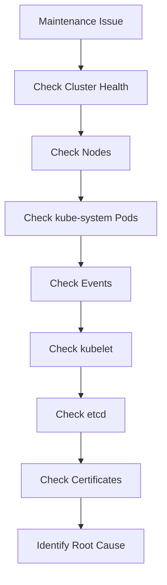

# Lab 10 - Cluster Maintenance Troubleshooting

## Difficulty

⭐⭐⭐⭐⭐ Expert

## Estimated Time

60–75 minutes

---

# CKA Objectives Covered

* Troubleshoot node maintenance issues
* Diagnose drain failures
* Troubleshoot kubelet problems
* Investigate etcd backup and restore issues
* Troubleshoot certificate problems
* Verify cluster health after maintenance

---

# Objective

In this lab, you will:

* Diagnose common cluster maintenance failures.
* Follow a structured troubleshooting workflow.
* Identify root causes.
* Verify the cluster after corrective actions.

---

# Troubleshooting Workflow



---

# Scenario 1 - Node Stuck in NotReady

## Symptoms

```text id="cmts02"
STATUS

NotReady
```

### Investigation

```bash id="cmts03"
kubectl get nodes

kubectl describe node <node-name>

systemctl status kubelet

journalctl -u kubelet -n 100
```

### Common Causes

* kubelet stopped
* Container runtime unavailable
* Network connectivity issue
* Disk or memory pressure

### Resolution

Verify:

* kubelet is running.
* Container runtime is healthy.
* Node can communicate with the API Server.

---

# Scenario 2 - Node Remains SchedulingDisabled

### Investigation

```bash id="cmts04"
kubectl get nodes
```

Expected:

```text id="cmts05"
Ready,SchedulingDisabled
```

### Root Cause

The node is still cordoned.

### Resolution

```bash id="cmts06"
kubectl uncordon <node-name>
```

Verify:

```bash id="cmts07"
kubectl get nodes
```

---

# Scenario 3 - Drain Never Completes

### Investigation

```bash id="cmts08"
kubectl get pdb -A

kubectl get pods -A
```

### Common Causes

* PodDisruptionBudget
* Unmanaged Pods
* Long termination grace period
* DaemonSet Pods

### Resolution

Review:

* PodDisruptionBudgets
* Drain options
* Pod ownership

---

# Scenario 4 - Worker Node NotReady After Upgrade

### Investigation

```bash id="cmts09"
systemctl status kubelet

journalctl -u kubelet -n 100

kubectl get nodes
```

### Root Cause

Possible causes:

* kubelet not restarted
* Configuration issue
* Runtime issue
* Network connectivity

### Resolution

Correct the underlying issue and verify the node reports `Ready`.

---

# Scenario 5 - etcd Backup Failure

## Symptoms

```text id="cmts10"
snapshot save failed
```

### Investigation

```bash id="cmts11"
ETCDCTL_API=3 etcdctl endpoint health \
--endpoints=https://127.0.0.1:2379
```

Verify:

* Endpoint
* Certificate paths
* Disk space

### Resolution

Correct the endpoint or certificate configuration and retry the backup.

---

# Scenario 6 - etcd Restore Failure

### Investigation

```bash id="cmts12"
ETCDCTL_API=3 etcdctl snapshot status snapshot.db
```

Verify:

* Snapshot integrity
* Restore directory
* Static Pod manifest

### Resolution

Restore into a new data directory and update the etcd static Pod manifest.

---

# Scenario 7 - Certificate Expired

## Symptoms

```text id="cmts13"
x509 certificate has expired
```

### Investigation

```bash id="cmts14"
sudo kubeadm certs check-expiration
```

### Resolution

```bash id="cmts15"
sudo kubeadm certs renew all

sudo systemctl restart kubelet
```

Verify cluster health afterward.

---

# Scenario 8 - kubeadm Upgrade Failure

### Investigation

```bash id="cmts16"
sudo kubeadm upgrade plan

kubectl get pods -n kube-system
```

### Common Causes

* Unsupported upgrade path
* Unhealthy control plane
* Version incompatibility

### Resolution

Review the upgrade plan and ensure all control plane components are healthy before retrying.

---

# Scenario 9 - Cluster Unhealthy After Maintenance

### Investigation

```bash id="cmts17"
kubectl get nodes

kubectl get pods -A

kubectl get pods -n kube-system

kubectl cluster-info

kubectl get events --sort-by=.lastTimestamp
```

### Verify

* Nodes are Ready
* API Server reachable
* CoreDNS healthy
* kube-proxy healthy
* Workloads running

---

# Scenario 10 - Complete Maintenance Verification

Run:

```bash id="cmts18"
kubectl cluster-info

kubectl get nodes

kubectl get pods -A

kubectl get pods -n kube-system

kubectl get events --sort-by=.lastTimestamp

systemctl status kubelet

sudo kubeadm certs check-expiration
```

This provides a quick health assessment after maintenance.

---

# Verification Checklist

✅ Nodes Ready

✅ kube-system Pods healthy

✅ kubelet running

✅ Certificates valid

✅ etcd backup verified

✅ Applications healthy

---

# Common Problems

| Problem             | Likely Cause                                   |
| ------------------- | ---------------------------------------------- |
| Node NotReady       | kubelet or runtime issue                       |
| SchedulingDisabled  | Node still cordoned                            |
| Drain hangs         | PDB or unmanaged Pods                          |
| Upgrade failure     | Unsupported version or unhealthy control plane |
| etcd backup failed  | Endpoint or certificate issue                  |
| etcd restore failed | Invalid restore procedure                      |
| Certificate expired | Renewal required                               |
| kubelet not running | Service or configuration issue                 |

---

# Production Checklist

Before maintenance:

* Verify cluster health.
* Create an etcd backup.
* Review the upgrade plan.

During maintenance:

* Cordon node.
* Drain node.
* Upgrade or repair.
* Restart kubelet if required.

After maintenance:

* Uncordon node.
* Verify nodes.
* Verify kube-system Pods.
* Review events.
* Validate applications.

---

# Knowledge Check

1. What is the first command you run when a node becomes `NotReady`?
2. Why might `kubectl drain` never finish?
3. Why should an etcd backup be verified before upgrades?
4. Which command checks certificate expiration?
5. Why is `kubectl get pods -n kube-system` important after maintenance?

---

# Cleanup

Remove any temporary test workloads created during troubleshooting.

Ensure all nodes are schedulable:

```bash id="cmts19"
kubectl get nodes

kubectl uncordon <node-name>
```

---

# Final Challenge

A production cluster has just completed a maintenance window.

Users report that:

* One worker node is `NotReady`.
* Another node is still `SchedulingDisabled`.
* Some application Pods remain `Pending`.
* The API Server is reachable.
* An etcd backup completed successfully before maintenance.

Your tasks:

1. Identify the likely causes of each issue.
2. List the troubleshooting commands you would run.
3. Resolve each problem.
4. Verify that the cluster is fully operational.
5. Explain why each verification step is important before declaring the maintenance complete.

---

# Chapter Summary

Congratulations! 🎉

You have completed the **Cluster Maintenance** chapter.

You now understand:

* Node maintenance
* Cordon, drain, and uncordon
* etcd backup and restore
* Certificate management
* kubeadm upgrades
* Version Skew Policy
* Production maintenance workflows
* Cluster maintenance troubleshooting

These skills are essential for both the **CKA exam** and real-world Kubernetes operations.
