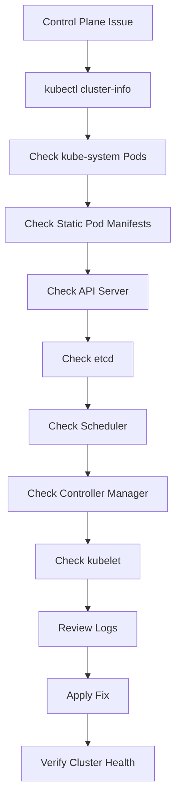

# Control Plane Debugging

```mermaid
flowchart TD
    ControlPlaneIssue[Control Plane Issue]
    ClusterInfo[kubectl cluster-info]
    SystemPods[Check kube-system Pods]
    StaticPods[Check Static Pod Manifests]
    APIServer[Check API Server]
    Etcd[Check etcd]
    Scheduler[Check Scheduler]
    Controller[Check Controller Manager]
    Kubelet[Check kubelet]
    Logs[Review Logs]
    Fix[Apply Fix]
    Verify[Verify Cluster Health]

    ControlPlaneIssue --> ClusterInfo
    ClusterInfo --> SystemPods
    SystemPods --> StaticPods
    StaticPods --> APIServer
    APIServer --> Etcd
    Etcd --> Scheduler
    Scheduler --> Controller
    Controller --> Kubelet
    Kubelet --> Logs
    Logs --> Fix
    Fix --> Verify
```

## Key Point

For control plane issues, check kube-system Pods, static Pod manifests, etcd, and kubelet health.
