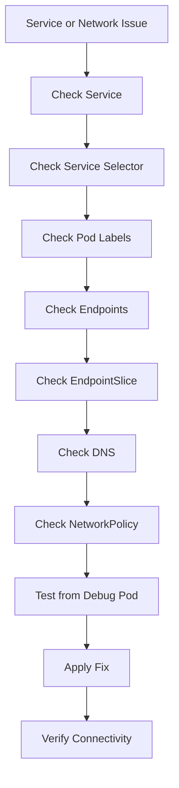

# Networking Debugging

```mermaid
flowchart TD
    NetworkIssue[Service or Network Issue]
    Service[Check Service]
    Selector[Check Service Selector]
    Labels[Check Pod Labels]
    Endpoints[Check Endpoints]
    EndpointSlice[Check EndpointSlice]
    DNS[Check DNS]
    Policy[Check NetworkPolicy]
    Test[Test from Debug Pod]
    Fix[Apply Fix]
    Verify[Verify Connectivity]

    NetworkIssue --> Service
    Service --> Selector
    Selector --> Labels
    Labels --> Endpoints
    Endpoints --> EndpointSlice
    EndpointSlice --> DNS
    DNS --> Policy
    Policy --> Test
    Test --> Fix
    Fix --> Verify
```

## Key Point

Most Service issues come from selector/label mismatches or empty Endpoints.
