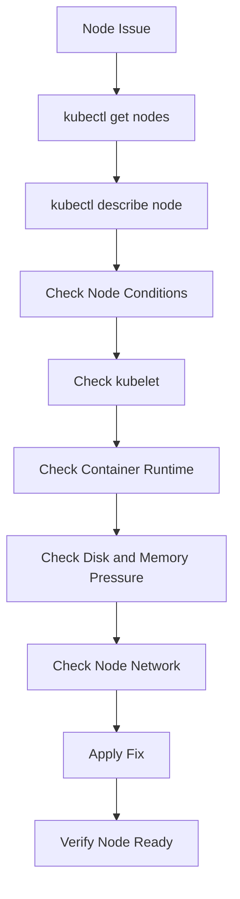

# Node Debugging

```mermaid
flowchart TD
    NodeIssue[Node Issue]
    GetNodes[kubectl get nodes]
    DescribeNode[kubectl describe node]
    Conditions[Check Node Conditions]
    Kubelet[Check kubelet]
    Runtime[Check Container Runtime]
    Resources[Check Disk and Memory Pressure]
    Network[Check Node Network]
    Fix[Apply Fix]
    Verify[Verify Node Ready]

    NodeIssue --> GetNodes
    GetNodes --> DescribeNode
    DescribeNode --> Conditions
    Conditions --> Kubelet
    Kubelet --> Runtime
    Runtime --> Resources
    Resources --> Network
    Network --> Fix
    Fix --> Verify
```

## Key Point

Node issues are commonly caused by kubelet failure, runtime issues, resource pressure, or network problems.
