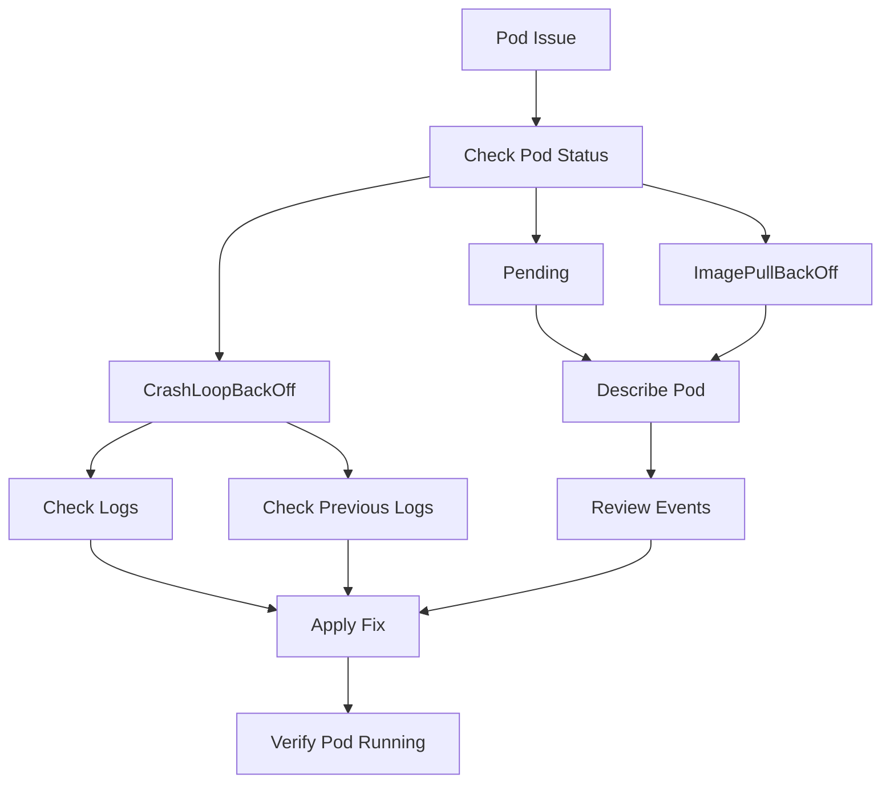

# Pod Debugging

```mermaid
flowchart TD
    PodIssue[Pod Issue]
    Status[Check Pod Status]
    Pending[Pending]
    Crash[CrashLoopBackOff]
    Image[ImagePullBackOff]
    Describe[Describe Pod]
    Events[Review Events]
    Logs[Check Logs]
    Previous[Check Previous Logs]
    Fix[Apply Fix]
    Verify[Verify Pod Running]

    PodIssue --> Status
    Status --> Pending
    Status --> Crash
    Status --> Image

    Pending --> Describe
    Crash --> Logs
    Crash --> Previous
    Image --> Describe

    Describe --> Events
    Logs --> Fix
    Previous --> Fix
    Events --> Fix
    Fix --> Verify
```

## Key Point

For Pod issues, start with status and events, then use logs when the container has actually started.
