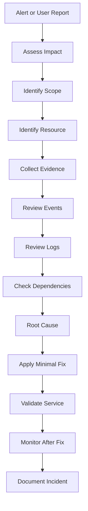

# Production Troubleshooting Workflow

## Key Point

Production troubleshooting should include impact assessment, evidence collection, minimal safe fixes, validation, monitoring, and documentation.
