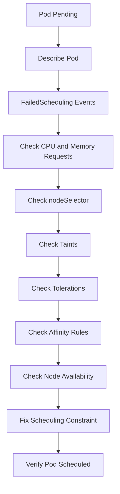

# Scheduling Debugging

```mermaid
flowchart TD
    PendingPod[Pod Pending]
    Describe[Describe Pod]
    Events[FailedScheduling Events]
    Resources[Check CPU and Memory Requests]
    NodeSelector[Check nodeSelector]
    Taints[Check Taints]
    Tolerations[Check Tolerations]
    Affinity[Check Affinity Rules]
    Nodes[Check Node Availability]
    Fix[Fix Scheduling Constraint]
    Verify[Verify Pod Scheduled]

    PendingPod --> Describe
    Describe --> Events
    Events --> Resources
    Resources --> NodeSelector
    NodeSelector --> Taints
    Taints --> Tolerations
    Tolerations --> Affinity
    Affinity --> Nodes
    Nodes --> Fix
    Fix --> Verify
```

## Key Point

Scheduling failures are usually explained in Pod events and are commonly caused by resources, taints, selectors, or affinity rules.
