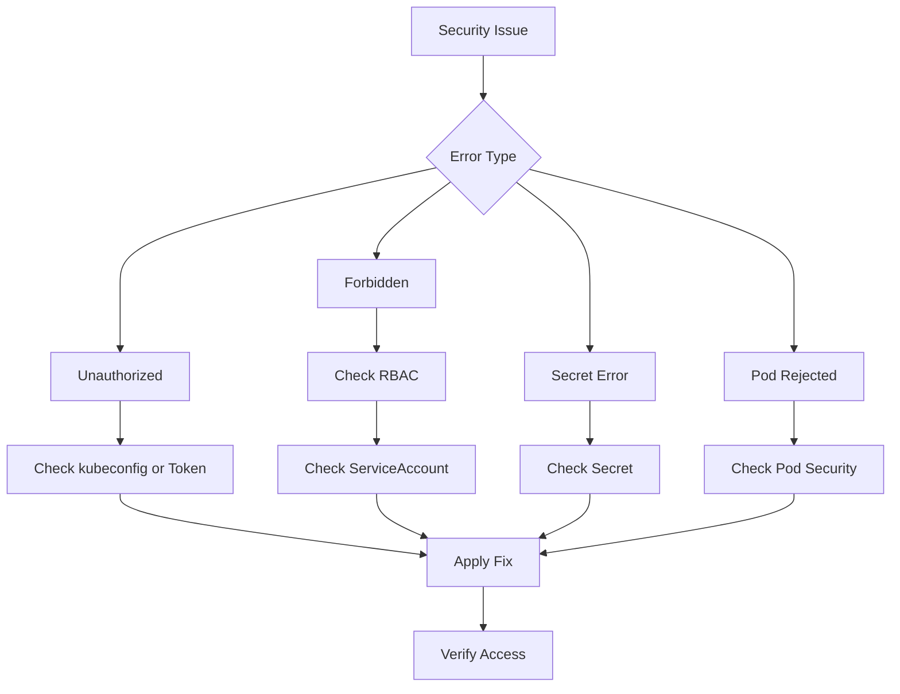

# Security Debugging

```mermaid
flowchart TD
    SecurityIssue[Security Issue]
    ErrorType{Error Type}
    Unauthorized[Unauthorized]
    Forbidden[Forbidden]
    SecretError[Secret Error]
    PodRejected[Pod Rejected]
    Kubeconfig[Check kubeconfig or Token]
    RBAC[Check RBAC]
    SA[Check ServiceAccount]
    Secret[Check Secret]
    PodSecurity[Check Pod Security]
    Fix[Apply Fix]
    Verify[Verify Access]

    SecurityIssue --> ErrorType

    ErrorType --> Unauthorized
    ErrorType --> Forbidden
    ErrorType --> SecretError
    ErrorType --> PodRejected

    Unauthorized --> Kubeconfig
    Forbidden --> RBAC
    RBAC --> SA
    SecretError --> Secret
    PodRejected --> PodSecurity

    Kubeconfig --> Fix
    SA --> Fix
    Secret --> Fix
    PodSecurity --> Fix
    Fix --> Verify
```

## Key Point

Unauthorized usually means authentication failed. Forbidden usually means authentication succeeded but RBAC denied the action.
