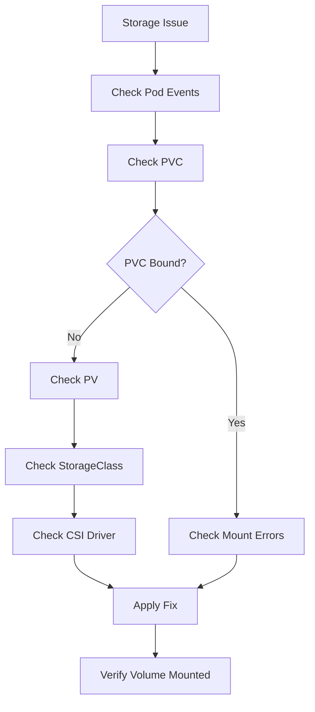

# Storage Debugging

```mermaid
flowchart TD
    StorageIssue[Storage Issue]
    Pod[Check Pod Events]
    PVC[Check PVC]
    PVCStatus{PVC Bound?}
    PV[Check PV]
    SC[Check StorageClass]
    CSI[Check CSI Driver]
    Mount[Check Mount Errors]
    Fix[Apply Fix]
    Verify[Verify Volume Mounted]

    StorageIssue --> Pod
    Pod --> PVC
    PVC --> PVCStatus
    PVCStatus -->|Yes| Mount
    PVCStatus -->|No| PV
    PV --> SC
    SC --> CSI
    CSI --> Fix
    Mount --> Fix
    Fix --> Verify
```

## Key Point

For storage problems, verify the PVC first. A Pod cannot mount storage correctly if the PVC is not bound.
