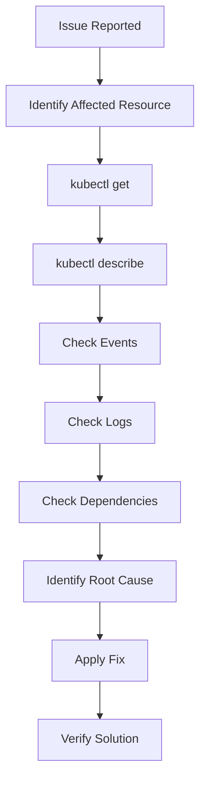

# Troubleshooting Workflow

```mermaid
flowchart TD
    Issue[Issue Reported]
    Identify[Identify Affected Resource]
    Get[kubectl get]
    Describe[kubectl describe]
    Events[Check Events]
    Logs[Check Logs]
    Dependencies[Check Dependencies]
    RootCause[Identify Root Cause]
    Fix[Apply Fix]
    Verify[Verify Solution]

    Issue --> Identify
    Identify --> Get
    Get --> Describe
    Describe --> Events
    Events --> Logs
    Logs --> Dependencies
    Dependencies --> RootCause
    RootCause --> Fix
    Fix --> Verify
```

## Key Point

Troubleshooting should follow a repeatable process: observe, collect evidence, identify root cause, fix, and verify.
