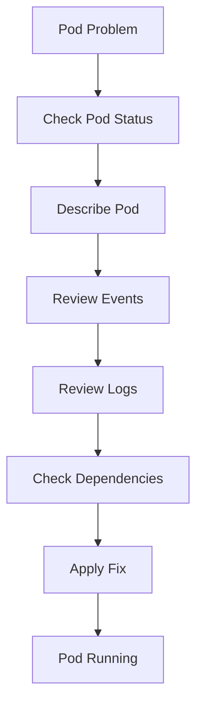

# Lab 01 - Pod Troubleshooting

## Difficulty

⭐⭐⭐ Intermediate

## Estimated Time

30–45 minutes

---

# CKA Objectives Covered

* Diagnose Pod failures
* Investigate Events
* Analyze container logs
* Troubleshoot common Pod states
* Verify successful recovery

---

# Objective

In this lab, you will troubleshoot common Pod failures including:

* Pending
* CrashLoopBackOff
* ImagePullBackOff
* ErrImagePull
* OOMKilled
* CreateContainerConfigError

Rather than creating applications, your goal is to **identify the root cause and restore the Pod to a healthy Running state**.

---

# Architecture



---

# Universal Troubleshooting Process

Always follow this sequence:

```text
kubectl get

↓

kubectl describe

↓

Review Events

↓

Review Logs

↓

Identify Root Cause

↓

Apply Fix

↓

Verify
```

Never guess.

---

# Scenario 1 - Pod Stuck in Pending

## Symptoms

```text
STATUS

Pending
```

---

## Investigation

```bash
kubectl get pods

kubectl describe pod <pod-name>
```

Look for Events such as:

```text
FailedScheduling
```

---

## Possible Causes

* No available nodes
* Insufficient CPU
* Insufficient memory
* nodeSelector mismatch
* Missing toleration
* PVC Pending

---

## Resolution

Correct the scheduling issue.

Verify:

```bash
kubectl get pods
```

Expected:

```text
Running
```

---

# Scenario 2 - CrashLoopBackOff

## Symptoms

```text
STATUS

CrashLoopBackOff
```

---

## Investigation

```bash
kubectl describe pod <pod-name>

kubectl logs <pod-name>

kubectl logs <pod-name> --previous
```

---

## Common Causes

* Application crash
* Missing configuration
* Database unavailable
* Invalid command
* OOMKilled

---

## Resolution

Fix the application or configuration issue.

Verify the Pod starts successfully.

---

# Scenario 3 - ImagePullBackOff

## Symptoms

```text
STATUS

ImagePullBackOff
```

---

## Investigation

```bash
kubectl describe pod <pod-name>
```

Typical Event:

```text
Failed to pull image
```

---

## Common Causes

* Incorrect image name
* Wrong image tag
* Private registry authentication
* Registry unavailable

---

## Resolution

Correct the image reference or registry credentials.

Verify:

```bash
kubectl get pods
```

---

# Scenario 4 - CreateContainerConfigError

## Symptoms

```text
CreateContainerConfigError
```

---

## Investigation

```bash
kubectl describe pod <pod-name>
```

Look for:

* Secret not found
* ConfigMap not found

Verify:

```bash
kubectl get secrets

kubectl get configmaps
```

---

## Resolution

Create or correct the missing resource.

---

# Scenario 5 - OOMKilled

## Symptoms

Container restarts repeatedly.

Events show:

```text
OOMKilled
```

---

## Investigation

```bash
kubectl describe pod <pod-name>

kubectl logs <pod-name>
```

---

## Resolution

Review:

* Memory limits
* Memory requests
* Application memory usage

Increase limits if appropriate.

---

# Scenario 6 - Pod Not Ready

## Symptoms

```text
READY

0/1
```

---

## Investigation

```bash
kubectl describe pod <pod-name>
```

Review:

* Readiness probe
* Liveness probe
* Startup probe

---

## Resolution

Correct the probe configuration or resolve the application issue.

---

# Useful Commands

```bash
kubectl get pods

kubectl describe pod <pod-name>

kubectl logs <pod-name>

kubectl logs <pod-name> --previous

kubectl get events --sort-by=.lastTimestamp

kubectl get pods -o wide

kubectl exec -it <pod-name> -- sh
```

---

# Verification Checklist

✅ Pod status checked.

✅ Pod described.

✅ Events reviewed.

✅ Logs reviewed.

✅ Root cause identified.

✅ Correct fix applied.

✅ Pod successfully Running.

---

# Common Mistakes

❌ Restarting the Pod before checking logs.

❌ Ignoring Events.

❌ Looking only at logs.

❌ Not checking previous logs.

❌ Assuming Kubernetes is the problem instead of the application.

---

# Production Discussion

A disciplined engineer follows evidence.

Typical workflow:

1. Check status.
2. Describe the Pod.
3. Review Events.
4. Review Logs.
5. Check dependencies.
6. Apply one fix.
7. Verify.

This minimizes risk and shortens incident resolution time.

---

# Knowledge Check

1. Which command provides the most useful troubleshooting information for a Pod?
2. Why should Events be reviewed before Logs?
3. When should `kubectl logs --previous` be used?
4. What causes `ImagePullBackOff`?
5. What causes `CreateContainerConfigError`?
6. What is the difference between `Pending` and `CrashLoopBackOff`?

---

# Challenge

You are given four Pods:

* Pod A is `Pending`.
* Pod B is `CrashLoopBackOff`.
* Pod C is `ImagePullBackOff`.
* Pod D is `CreateContainerConfigError`.

For each Pod:

1. Identify the correct troubleshooting commands.
2. Determine the likely root cause.
3. Apply the appropriate fix.
4. Verify the Pod reaches the `Running` state.
5. Explain why your troubleshooting process followed a logical sequence instead of relying on guesswork.
