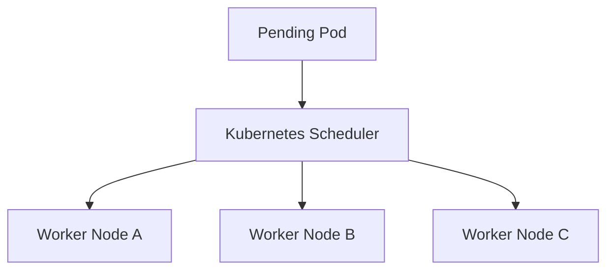

# Lab 02 - Scheduling Troubleshooting

## Difficulty

⭐⭐⭐⭐ Intermediate

## Estimated Time

35–45 minutes

---

# CKA Objectives Covered

* Troubleshoot Pending Pods
* Diagnose scheduler failures
* Investigate nodeSelector issues
* Troubleshoot taints and tolerations
* Verify affinity rules
* Resolve resource constraints

---

# Objective

In this lab, you will troubleshoot common scheduling failures including:

* FailedScheduling
* nodeSelector mismatch
* Taints and Tolerations
* Node Affinity
* Insufficient CPU
* Insufficient Memory
* Unschedulable nodes

Your goal is to identify why the scheduler cannot place a Pod and restore normal scheduling.

---

# Architecture



---

# Scheduling Troubleshooting Workflow

```text id="sch02"
Pod Pending

↓

Describe Pod

↓

Review Events

↓

Check Nodes

↓

Check Resources

↓

Check Labels

↓

Check Taints

↓

Check Affinity

↓

Apply Fix

↓

Verify
```

---

# Scenario 1 - FailedScheduling

## Symptoms

```text id="sch03"
STATUS

Pending
```

---

## Investigation

```bash id="sch04"
kubectl get pods

kubectl describe pod <pod-name>
```

Look for:

```text id="sch05"
FailedScheduling
```

This Event explains why the scheduler rejected the Pod.

---

# Scenario 2 - nodeSelector Mismatch

## Investigation

Check Pod configuration:

```bash id="sch06"
kubectl get pod <pod-name> -o yaml
```

Locate:

```yaml id="sch07"
nodeSelector:
```

Check node labels:

```bash id="sch08"
kubectl get nodes --show-labels
```

---

## Resolution

Either:

* Add the required label to a node

```bash id="sch09"
kubectl label node <node-name> disktype=ssd
```

or

* Update the Pod's nodeSelector.

---

# Scenario 3 - Taints and Tolerations

## Investigation

Describe the node:

```bash id="sch10"
kubectl describe node <node-name>
```

Look for:

```text id="sch11"
Taints:
```

Describe the Pod:

```bash id="sch12"
kubectl describe pod <pod-name>
```

Review:

```text id="sch13"
Tolerations:
```

---

## Resolution

Either:

* Add the appropriate toleration to the Pod.

or

* Remove the unnecessary taint from the node.

---

# Scenario 4 - Node Affinity

## Investigation

```bash id="sch14"
kubectl get pod <pod-name> -o yaml
```

Look for:

```yaml id="sch15"
affinity:
```

Verify node labels:

```bash id="sch16"
kubectl get nodes --show-labels
```

---

## Resolution

Ensure at least one node satisfies the affinity rules.

---

# Scenario 5 - Insufficient CPU

## Symptoms

Events show:

```text id="sch17"
Insufficient cpu
```

---

## Investigation

Describe the Pod:

```bash id="sch18"
kubectl describe pod <pod-name>
```

View node capacity:

```bash id="sch19"
kubectl describe node <node-name>
```

If Metrics Server is installed:

```bash id="sch20"
kubectl top nodes
```

---

## Resolution

Possible fixes:

* Reduce CPU requests.
* Add worker nodes.
* Increase node capacity.

---

# Scenario 6 - Insufficient Memory

## Symptoms

```text id="sch21"
Insufficient memory
```

---

## Investigation

```bash id="sch22"
kubectl describe node <node-name>

kubectl top nodes
```

---

## Resolution

* Reduce memory requests.
* Scale the cluster.
* Free node resources.

---

# Scenario 7 - Node Cordoned

## Symptoms

Node status:

```text id="sch23"
Ready,SchedulingDisabled
```

---

## Investigation

```bash id="sch24"
kubectl get nodes
```

---

## Resolution

```bash id="sch25"
kubectl uncordon <node-name>
```

---

# Useful Commands

```bash id="sch26"
kubectl get pods

kubectl describe pod <pod-name>

kubectl get nodes

kubectl describe node <node-name>

kubectl get nodes --show-labels

kubectl top nodes

kubectl get events --sort-by=.lastTimestamp
```

---

# Verification Checklist

✅ Pod described.

✅ Events reviewed.

✅ Node labels verified.

✅ Taints reviewed.

✅ Affinity checked.

✅ Resources verified.

✅ Pod successfully scheduled.

---

# Common Mistakes

❌ Looking only at the Pod status.

❌ Ignoring scheduler Events.

❌ Forgetting to inspect node labels.

❌ Confusing taints with tolerations.

❌ Assuming every Pending Pod is caused by insufficient resources.

---

# Production Discussion

Most scheduling failures can be diagnosed by following this order:

1. Describe the Pod.
2. Review Events.
3. Check node availability.
4. Check node labels.
5. Check taints.
6. Check affinity.
7. Check CPU and memory.
8. Verify scheduling after applying the fix.

---

# Knowledge Check

1. What command usually provides the root cause of a scheduling failure?
2. How do you view node labels?
3. What is the difference between a taint and a toleration?
4. Why might a nodeSelector prevent scheduling?
5. What does `Ready,SchedulingDisabled` indicate?

---

# Challenge

You are given six Pending Pods.

Each has a different scheduling problem:

* Pod A: nodeSelector mismatch
* Pod B: Missing toleration
* Pod C: Node affinity mismatch
* Pod D: Insufficient CPU
* Pod E: Insufficient memory
* Pod F: Worker node cordoned

For each Pod:

1. Describe the Pod.
2. Review Events.
3. Identify the scheduling constraint.
4. Apply the appropriate fix.
5. Verify the Pod reaches the `Running` state.
6. Explain why the scheduler originally rejected the Pod.
