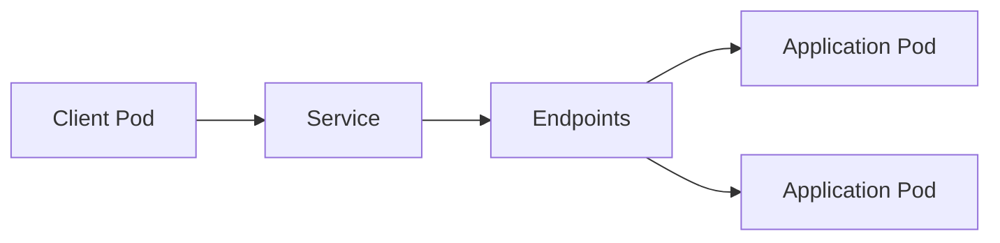

# Lab 03 - Service & Network Troubleshooting

## Difficulty

⭐⭐⭐⭐ Intermediate

## Estimated Time

40–50 minutes

---

# CKA Objectives Covered

* Troubleshoot Service connectivity
* Verify Service selectors
* Diagnose Endpoint issues
* Troubleshoot ClusterIP and NodePort
* Investigate NetworkPolicy
* Validate application connectivity

---

# Objective

In this lab, you will troubleshoot common networking issues involving:

* Service not reachable
* Empty Endpoints
* Selector mismatch
* Incorrect targetPort
* ClusterIP failures
* NodePort access problems
* NetworkPolicy blocking traffic

Your goal is to restore communication between clients and application Pods.

---

# Architecture



---

# Networking Troubleshooting Workflow

```text id="net02"
Application Cannot Connect

↓

Check Service

↓

Describe Service

↓

Check Selector

↓

Check Pod Labels

↓

Check Endpoints

↓

Check EndpointSlices

↓

Test Connectivity

↓

Check NetworkPolicy

↓

Apply Fix

↓

Verify
```

---

# Scenario 1 - Service Not Reachable

## Symptoms

Application cannot access:

```text id="net03"
http://my-service
```

---

## Investigation

```bash id="net04"
kubectl get svc

kubectl describe svc my-service
```

Verify:

* ClusterIP
* Ports
* Selector
* targetPort

---

# Scenario 2 - Empty Endpoints

## Investigation

```bash id="net05"
kubectl get endpoints
```

Expected problem:

```text id="net06"
ENDPOINTS

<none>
```

---

## Resolution

Verify Pod labels:

```bash id="net07"
kubectl get pods --show-labels
```

Verify Service selector:

```bash id="net08"
kubectl describe svc my-service
```

Correct either:

* Pod labels
* Service selector

---

# Scenario 3 - Wrong targetPort

## Investigation

Describe the Service:

```bash id="net09"
kubectl describe svc my-service
```

Compare:

* Service `targetPort`
* Container `containerPort`

Inspect Pod:

```bash id="net10"
kubectl get pod <pod-name> -o yaml
```

---

## Resolution

Update the Service so the `targetPort` matches the application's listening port.

---

# Scenario 4 - ClusterIP Connectivity Failure

## Investigation

Launch a temporary test Pod:

```bash id="net11"
kubectl run net-test \
--image=busybox:1.36 \
-it --rm --restart=Never -- sh
```

Inside the Pod:

```sh id="net12"
wget -qO- http://my-service
```

If DNS is working, also test:

```sh id="net13"
wget -qO- http://<cluster-ip>
```

---

# Scenario 5 - NodePort Not Accessible

## Investigation

```bash id="net14"
kubectl get svc
```

Verify:

* NodePort
* Target node
* Firewall or security rules (outside Kubernetes if applicable)

---

## Resolution

Confirm:

* Service type is `NodePort`.
* Correct port is used.
* Backend Pods are healthy.

---

# Scenario 6 - NetworkPolicy Blocking Traffic

## Investigation

```bash id="net15"
kubectl get networkpolicy
```

Describe the policy:

```bash id="net16"
kubectl describe networkpolicy <policy-name>
```

Review:

* Pod selectors
* Ingress rules
* Egress rules

---

## Resolution

Update the NetworkPolicy to allow the required traffic.

---

# Scenario 7 - Service Selects the Wrong Pods

## Investigation

Check the selector:

```bash id="net17"
kubectl describe svc my-service
```

Check Pod labels:

```bash id="net18"
kubectl get pods --show-labels
```

---

## Resolution

Ensure the selector exactly matches the intended application Pods.

---

# Scenario 8 - EndpointSlice Verification

```bash id="net19"
kubectl get endpointslice
```

Describe:

```bash id="net20"
kubectl describe endpointslice
```

Verify:

* Backend IPs
* Ready condition
* Port information

---

# Useful Commands

```bash id="net21"
kubectl get svc

kubectl describe svc <service-name>

kubectl get endpoints

kubectl get endpointslice

kubectl get pods --show-labels

kubectl describe networkpolicy <policy-name>

kubectl run net-test \
--image=busybox:1.36 \
-it --rm --restart=Never -- sh
```

---

# Verification Checklist

✅ Service verified.

✅ Selector verified.

✅ Pod labels verified.

✅ Endpoints populated.

✅ EndpointSlices verified.

✅ NetworkPolicy reviewed.

✅ Client successfully connects.

---

# Common Mistakes

❌ Assuming the Service is broken without checking Endpoints.

❌ Forgetting to compare selectors with Pod labels.

❌ Ignoring `targetPort`.

❌ Blaming DNS before verifying the Service.

❌ Forgetting to test from inside the cluster.

---

# Production Discussion

When a Service fails, troubleshoot in this order:

1. Service exists.
2. Service selector.
3. Pod labels.
4. Endpoints.
5. EndpointSlices.
6. Pod health.
7. NetworkPolicy.
8. Client connectivity.

This narrows the problem quickly and avoids unnecessary changes.

---

# Knowledge Check

1. Which command shows whether a Service has backend Pods?
2. What causes an Endpoint list to be empty?
3. Why is `targetPort` important?
4. How can you test connectivity from inside the cluster?
5. When should NetworkPolicy be investigated?

---

# Challenge

A client Pod cannot access `frontend-service`.

Investigate the following possible causes:

* Service selector mismatch
* Incorrect Pod labels
* Empty Endpoints
* Wrong `targetPort`
* NetworkPolicy denying traffic
* Backend Pod not Ready

For each issue:

1. Identify the troubleshooting commands.
2. Determine the root cause.
3. Apply the fix.
4. Verify successful communication.
5. Explain why checking the Service alone is not sufficient to diagnose networking problems.
