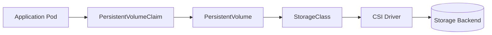

# Lab 05 - Storage Troubleshooting

## Difficulty

⭐⭐⭐⭐ Intermediate

## Estimated Time

40–50 minutes

---

# CKA Objectives Covered

* Troubleshoot PersistentVolumeClaims
* Diagnose PersistentVolume binding failures
* Verify StorageClasses
* Investigate CSI driver issues
* Troubleshoot volume mount failures
* Verify persistent storage functionality

---

# Objective

In this lab, you will troubleshoot common storage issues including:

* PVC Pending
* PV not binding
* StorageClass configuration problems
* CSI driver failures
* Volume mount errors
* Read-only filesystem issues

Your goal is to restore persistent storage access for Kubernetes workloads.

---

# Architecture



---

# Storage Troubleshooting Workflow

```text id="stg02"
Storage Problem

↓

Describe Pod

↓

Review Events

↓

Check PVC

↓

Check PV

↓

Check StorageClass

↓

Check CSI Driver

↓

Apply Fix

↓

Verify Volume Mounted
```

---

# Scenario 1 - PVC Stuck in Pending

## Symptoms

```text id="stg03"
STATUS

Pending
```

---

## Investigation

```bash id="stg04"
kubectl get pvc

kubectl describe pvc <pvc-name>
```

Look for Events indicating:

* No matching PV
* StorageClass not found
* Provisioning failure

---

## Resolution

Verify:

* Correct StorageClass
* Matching access mode
* Sufficient capacity
* Dynamic provisioning is working

---

# Scenario 2 - PV Not Bound

## Investigation

```bash id="stg05"
kubectl get pv

kubectl describe pv <pv-name>
```

Verify:

* Capacity
* AccessModes
* ReclaimPolicy
* ClaimRef

---

## Resolution

Ensure the PV satisfies the PVC requirements.

---

# Scenario 3 - StorageClass Problem

## Investigation

```bash id="stg06"
kubectl get sc

kubectl describe sc <storageclass-name>
```

Verify:

* Provisioner
* Default StorageClass
* Parameters
* VolumeBindingMode

---

## Resolution

Correct the StorageClass configuration or reference the appropriate StorageClass in the PVC.

---

# Scenario 4 - CSI Driver Failure

## Investigation

List CSI drivers:

```bash id="stg07"
kubectl get csidriver
```

List CSI nodes:

```bash id="stg08"
kubectl get csinode
```

Inspect CSI Pods:

```bash id="stg09"
kubectl get pods -A | grep csi
```

Review CSI logs if necessary:

```bash id="stg10"
kubectl logs <csi-pod> -n <namespace>
```

---

## Resolution

Ensure the CSI driver is healthy and communicating with the storage backend.

---

# Scenario 5 - Volume Mount Failure

## Symptoms

Pod Events show:

```text id="stg11"
FailedMount
```

---

## Investigation

```bash id="stg12"
kubectl describe pod <pod-name>
```

Review:

* Volume names
* Mount paths
* PVC status

---

## Resolution

Correct:

* Volume references
* PVC binding
* CSI driver issues

---

# Scenario 6 - Read-Only Filesystem

## Investigation

Describe the Pod:

```bash id="stg13"
kubectl describe pod <pod-name>
```

Inside the container:

```bash id="stg14"
kubectl exec -it <pod-name> -- mount

kubectl exec -it <pod-name> -- df -h
```

---

## Resolution

Verify:

* Mount options
* Storage backend configuration
* Volume permissions
* Application write path

---

# Scenario 7 - Application Cannot Write Data

## Investigation

Verify the mounted filesystem:

```bash id="stg15"
kubectl exec -it <pod-name> -- ls -l <mount-path>

kubectl exec -it <pod-name> -- touch <mount-path>/testfile
```

Check:

* File ownership
* Permissions
* SecurityContext (`runAsUser`, `fsGroup`)
* Volume mount mode

---

## Resolution

Correct permissions or Pod security settings if required.

---

# Useful Commands

```bash id="stg16"
kubectl get pvc

kubectl describe pvc <pvc-name>

kubectl get pv

kubectl describe pv <pv-name>

kubectl get sc

kubectl get csidriver

kubectl get csinode

kubectl describe pod <pod-name>

kubectl exec -it <pod-name> -- df -h

kubectl exec -it <pod-name> -- mount
```

---

# Verification Checklist

✅ PVC verified.

✅ PV verified.

✅ StorageClass verified.

✅ CSI driver healthy.

✅ Volume mounted.

✅ Application can read and write data.

---

# Common Mistakes

❌ Checking only the Pod.

❌ Ignoring PVC Events.

❌ Assuming every Pending PVC is caused by missing storage.

❌ Forgetting to verify the StorageClass.

❌ Ignoring CSI driver health.

❌ Not testing file read/write access inside the container.

---

# Production Discussion

Always troubleshoot storage in dependency order:

```text id="stg17"
Pod

↓

PVC

↓

PV

↓

StorageClass

↓

CSI Driver

↓

Storage Backend
```

This method quickly identifies where the storage workflow has failed.

---

# Knowledge Check

1. Which command provides the most useful information about a Pending PVC?
2. What conditions must a PV satisfy before binding to a PVC?
3. Why is the StorageClass important?
4. What is the role of the CSI driver?
5. How can you verify that a mounted volume is writable?

---

# Challenge

A Stateful application fails to start because persistent storage is unavailable.

Investigate the following:

* Pod Events
* PVC status
* PV binding
* StorageClass configuration
* CSI driver health
* Mounted filesystem permissions

For each issue:

1. Identify the troubleshooting commands.
2. Determine the root cause.
3. Apply the appropriate fix.
4. Verify the application can successfully read and write persistent data.
5. Explain why troubleshooting should follow the **Pod → PVC → PV → StorageClass → CSI Driver** dependency chain.
