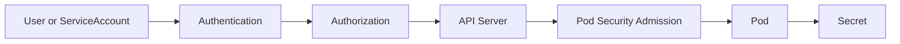

# Lab 06 - Security Troubleshooting

## Difficulty

⭐⭐⭐⭐ Intermediate

## Estimated Time

40–50 minutes

---

# CKA Objectives Covered

* Troubleshoot RBAC authorization failures
* Differentiate authentication and authorization issues
* Diagnose ServiceAccount problems
* Troubleshoot Secret-related failures
* Investigate Pod Security Admission rejections
* Verify SecurityContext configuration

---

# Objective

In this lab, you will troubleshoot common Kubernetes security issues including:

* Unauthorized
* Forbidden
* Missing Secrets
* ServiceAccount misconfiguration
* Pod Security Admission failures
* SecurityContext problems

Your goal is to restore secure access while maintaining the principle of least privilege.

---

# Architecture



---

# Security Troubleshooting Workflow

```text id="sec02"
Security Error

↓

Read Error Message

↓

Authentication?

↓

Authorization?

↓

ServiceAccount?

↓

Secret?

↓

Pod Security?

↓

SecurityContext?

↓

Apply Fix

↓

Verify
```

---

# Scenario 1 - Unauthorized

## Symptoms

```text id="sec03"
Unauthorized
```

---

## Investigation

Verify the current context:

```bash id="sec04"
kubectl config current-context
```

View kubeconfig:

```bash id="sec05"
kubectl config view
```

Check credentials and certificate validity if applicable.

---

## Resolution

Correct:

* kubeconfig
* Token
* Client certificate
* Authentication configuration

---

# Scenario 2 - Forbidden

## Symptoms

```text id="sec06"
Error from server (Forbidden)
```

---

## Investigation

Verify permissions:

```bash id="sec07"
kubectl auth can-i get pods
```

Check as a ServiceAccount:

```bash id="sec08"
kubectl auth can-i list pods \
--as=system:serviceaccount:<namespace>:<serviceaccount>
```

Review RBAC:

```bash id="sec09"
kubectl get roles

kubectl get rolebindings

kubectl get clusterroles

kubectl get clusterrolebindings
```

---

## Resolution

Grant only the required permissions through Role/ClusterRole and the appropriate binding.

---

# Scenario 3 - ServiceAccount Misconfiguration

## Investigation

Describe the Pod:

```bash id="sec10"
kubectl describe pod <pod-name>
```

Verify the ServiceAccount:

```bash id="sec11"
kubectl get sa

kubectl describe sa <serviceaccount-name>
```

---

## Resolution

Ensure the Pod references the correct ServiceAccount and that the ServiceAccount has the necessary RBAC permissions.

---

# Scenario 4 - Secret Not Found

## Symptoms

Pod Events:

```text id="sec12"
secret "<secret-name>" not found
```

---

## Investigation

```bash id="sec13"
kubectl get secrets

kubectl describe pod <pod-name>
```

Verify:

* Secret name
* Namespace
* Volume or environment variable references

---

## Resolution

Create the missing Secret or update the Pod manifest to reference the correct Secret.

---

# Scenario 5 - Pod Security Admission Rejection

## Symptoms

```text id="sec14"
violates PodSecurity
```

---

## Investigation

Describe the Pod:

```bash id="sec15"
kubectl describe pod <pod-name>
```

Review:

* SecurityContext
* Privileged containers
* HostPath volumes
* Host networking
* Capabilities

Check namespace labels:

```bash id="sec16"
kubectl get ns --show-labels
```

---

## Resolution

Modify the Pod specification or adjust namespace Pod Security Admission labels according to organizational policy.

---

# Scenario 6 - SecurityContext Issues

## Investigation

Inspect the Pod manifest:

```bash id="sec17"
kubectl get pod <pod-name> -o yaml
```

Review:

* runAsUser
* runAsGroup
* fsGroup
* readOnlyRootFilesystem
* allowPrivilegeEscalation
* capabilities

---

## Resolution

Correct the SecurityContext while following least-privilege principles.

---

# Scenario 7 - Application Cannot Read Mounted Secret

## Investigation

Inside the Pod:

```bash id="sec18"
kubectl exec -it <pod-name> -- ls -l /path/to/secret

kubectl exec -it <pod-name> -- cat /path/to/secret/<file>
```

Verify:

* Secret mounted successfully.
* File permissions.
* Correct mount path.

---

## Resolution

Correct the Secret mount configuration or application path.

---

# Useful Commands

```bash id="sec19"
kubectl auth can-i get pods

kubectl get roles

kubectl get rolebindings

kubectl get clusterroles

kubectl get clusterrolebindings

kubectl get sa

kubectl describe sa <serviceaccount-name>

kubectl get secrets

kubectl describe pod <pod-name>

kubectl get ns --show-labels
```

---

# Verification Checklist

✅ Authentication verified.

✅ Authorization verified.

✅ ServiceAccount verified.

✅ Secret available.

✅ Pod Security Admission satisfied.

✅ SecurityContext validated.

✅ Application functioning correctly.

---

# Common Mistakes

❌ Confusing `Unauthorized` with `Forbidden`.

❌ Granting excessive RBAC permissions instead of the minimum required.

❌ Looking for Secrets in the wrong namespace.

❌ Ignoring the ServiceAccount assigned to the Pod.

❌ Disabling security controls instead of correcting the Pod specification.

---

# Production Discussion

Use this decision process:

```text id="sec20"
Unauthorized

↓

Authentication

Forbidden

↓

RBAC

Pod Rejected

↓

Pod Security Admission

Application Failure

↓

Secret or SecurityContext
```

Following this sequence quickly identifies the correct security layer to investigate.

---

# Knowledge Check

1. What is the difference between `Unauthorized` and `Forbidden`?
2. Which command verifies RBAC permissions?
3. Why is the ServiceAccount important?
4. How do you troubleshoot a missing Secret?
5. What is the purpose of Pod Security Admission?

---

# Challenge

A production application fails after deployment.

Investigate the following possible causes:

* Invalid kubeconfig
* Missing RBAC permissions
* Incorrect ServiceAccount
* Secret not found
* Pod Security Admission rejection
* Invalid SecurityContext

For each issue:

1. Identify the troubleshooting commands.
2. Determine the root cause.
3. Apply the least-privilege fix.
4. Verify the application functions correctly.
5. Explain why distinguishing **authentication**, **authorization**, and **admission control** is important during Kubernetes security troubleshooting.
