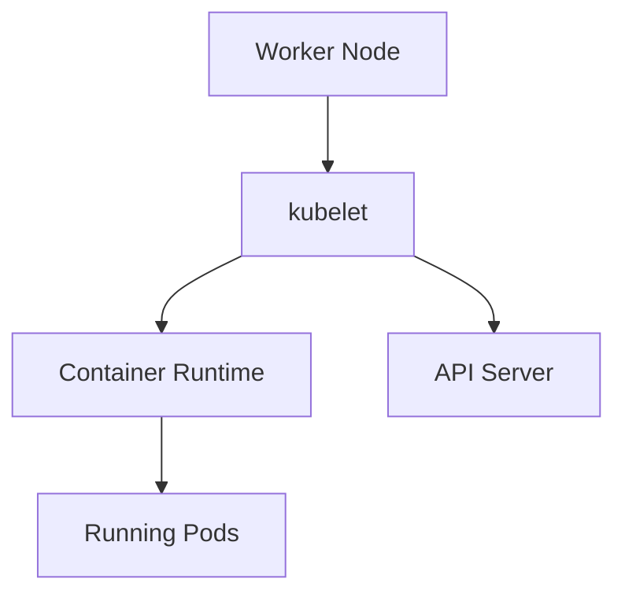

# Lab 08 - Node Troubleshooting

## Difficulty

⭐⭐⭐⭐⭐ Advanced

## Estimated Time

45–60 minutes

---

# CKA Objectives Covered

* Troubleshoot NotReady nodes
* Diagnose kubelet failures
* Investigate container runtime issues
* Troubleshoot node resource pressure
* Verify scheduling status
* Restore node health

---

# Objective

In this lab, you will troubleshoot common worker node problems including:

* Node NotReady
* SchedulingDisabled
* DiskPressure
* MemoryPressure
* PIDPressure
* kubelet failures
* Container runtime failures
* Network connectivity issues

Your goal is to restore the node to a healthy `Ready` state.

---

# Architecture



---

# Node Troubleshooting Workflow

```text id="node02"
Node Problem

↓

Check Node Status

↓

Describe Node

↓

Review Conditions

↓

Check kubelet

↓

Check Container Runtime

↓

Check Resources

↓

Check Network

↓

Apply Fix

↓

Verify Node Ready
```

---

# Scenario 1 - Node NotReady

## Symptoms

```text id="node03"
STATUS

NotReady
```

---

## Investigation

```bash id="node04"
kubectl get nodes

kubectl describe node <node-name>
```

Review:

* Conditions
* Events
* Last heartbeat

---

## Resolution

Determine whether the issue is caused by:

* kubelet
* Runtime
* Resource pressure
* Network

Restore normal node health.

---

# Scenario 2 - kubelet Failure

## Investigation

On the node:

```bash id="node05"
systemctl status kubelet

journalctl -u kubelet -n 100
```

Verify:

* Service running
* Configuration
* Startup errors

---

## Resolution

Restart if appropriate:

```bash id="node06"
sudo systemctl restart kubelet
```

If the issue persists, investigate configuration or dependency failures.

---

# Scenario 3 - Container Runtime Failure

## Investigation

Check the runtime service.

For containerd:

```bash id="node07"
systemctl status containerd
```

List containers:

```bash id="node08"
crictl ps -a
```

Review runtime logs:

```bash id="node09"
journalctl -u containerd -n 100
```

---

## Resolution

Restore the container runtime and verify kubelet reconnects successfully.

---

# Scenario 4 - DiskPressure

## Symptoms

Node condition:

```text id="node10"
DiskPressure=True
```

---

## Investigation

```bash id="node11"
kubectl describe node <node-name>
```

On the node:

```bash id="node12"
df -h

du -sh /var/lib/containerd/*

du -sh /var/log/*
```

---

## Resolution

Free disk space by removing unnecessary data, logs, or unused container images according to your operational procedures.

---

# Scenario 5 - MemoryPressure

## Symptoms

```text id="node13"
MemoryPressure=True
```

---

## Investigation

```bash id="node14"
kubectl describe node <node-name>
```

If Metrics Server is available:

```bash id="node15"
kubectl top node <node-name>
```

On the node:

```bash id="node16"
free -h
```

---

## Resolution

Reduce memory consumption or increase available memory.

Investigate workloads consuming excessive resources.

---

# Scenario 6 - SchedulingDisabled

## Symptoms

```text id="node17"
Ready,SchedulingDisabled
```

---

## Investigation

```bash id="node18"
kubectl get nodes
```

---

## Resolution

If maintenance is complete:

```bash id="node19"
kubectl uncordon <node-name>
```

Verify:

```bash id="node20"
kubectl get nodes
```

---

# Scenario 7 - Network Connectivity Problem

## Investigation

Describe the node:

```bash id="node21"
kubectl describe node <node-name>
```

Check API Server connectivity from the node.

Verify:

* Node networking
* Firewall configuration
* Routing
* DNS resolution

Review kubelet logs:

```bash id="node22"
journalctl -u kubelet -n 100
```

---

## Resolution

Restore communication between the node and the control plane.

---

# Scenario 8 - Verify Node Recovery

Run:

```bash id="node23"
kubectl get nodes

kubectl get pods -o wide

kubectl get events --sort-by=.lastTimestamp
```

Verify:

* Node is Ready.
* Pods scheduled successfully.
* No critical warning Events remain.

---

# Useful Commands

```bash id="node24"
kubectl get nodes

kubectl describe node <node-name>

systemctl status kubelet

journalctl -u kubelet -n 100

systemctl status containerd

journalctl -u containerd -n 100

crictl ps -a

kubectl top nodes

df -h

free -h
```

---

# Verification Checklist

✅ Node status verified.

✅ Node conditions reviewed.

✅ kubelet healthy.

✅ Container runtime healthy.

✅ Resource pressure resolved.

✅ Network connectivity restored.

✅ Node reports `Ready`.

---

# Common Mistakes

❌ Assuming the application is at fault.

❌ Restarting kubelet without reviewing logs.

❌ Ignoring DiskPressure and MemoryPressure conditions.

❌ Forgetting to uncordon a node after maintenance.

❌ Investigating Pods before verifying node health.

---

# Production Discussion

A recommended troubleshooting sequence:

```text id="node25"
Node Status

↓

Node Conditions

↓

kubelet

↓

Container Runtime

↓

Resources

↓

Network

↓

Applications

↓

Verify
```

This approach addresses the lowest-level dependencies first and avoids unnecessary application-level debugging.

---

# Knowledge Check

1. What does `NotReady` indicate?
2. Which service is responsible for communicating node status to the control plane?
3. How do you investigate kubelet failures?
4. What causes `DiskPressure`?
5. What does `SchedulingDisabled` mean?

---

# Challenge

A worker node has become unavailable.

Investigate the following:

* Node status
* Node conditions
* kubelet service
* Container runtime
* Disk usage
* Memory usage
* Network connectivity

For each issue:

1. Identify the troubleshooting commands.
2. Determine the root cause.
3. Apply the appropriate fix.
4. Verify that the node returns to the `Ready` state.
5. Explain why node-level problems should be resolved before troubleshooting workloads running on that node.
