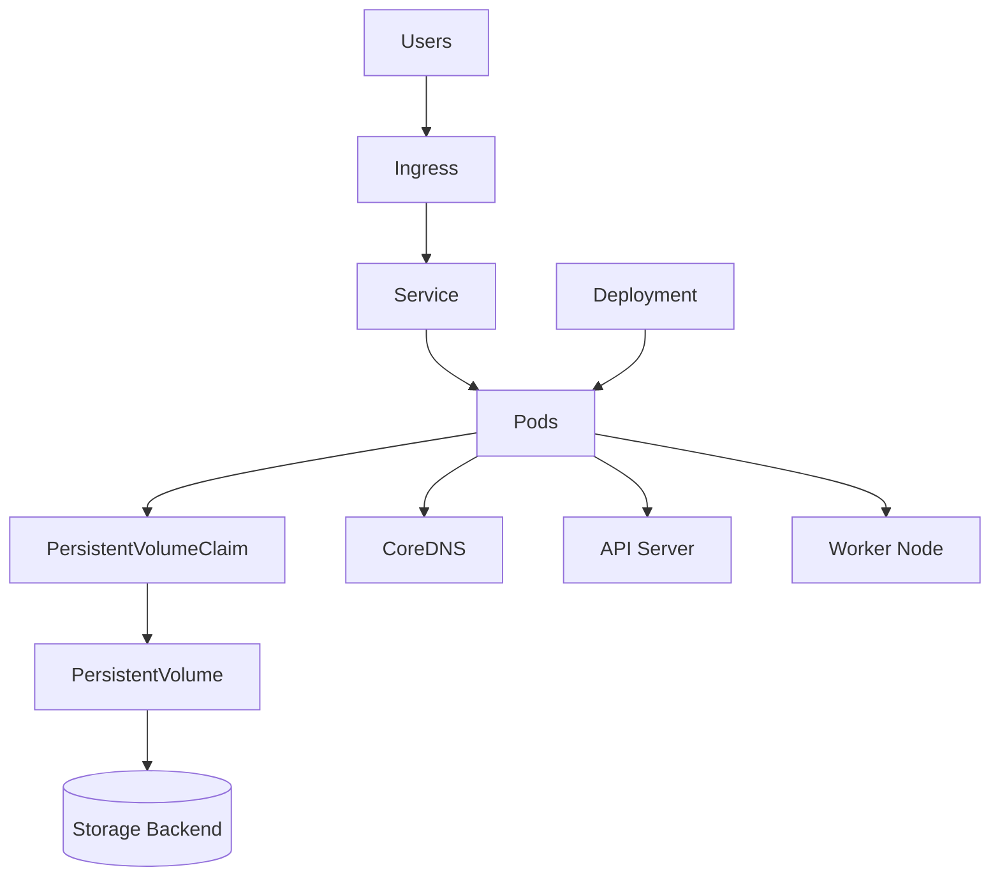

# Lab 09 - End-to-End Production Issue

## Difficulty

⭐⭐⭐⭐⭐ Expert

## Estimated Time

60–90 minutes

---

# CKA Objectives Covered

* Apply a structured troubleshooting methodology
* Diagnose failures across multiple Kubernetes domains
* Restore application availability
* Verify complete cluster health

---

# Objective

A production application has become unavailable.

Users report:

* The web application is inaccessible.
* Some Pods are not running.
* New Deployments remain Pending.
* Storage is unavailable.
* Internal service communication fails.

Your task is to investigate the entire Kubernetes stack, identify every root cause, restore the application, and verify the cluster.

---

# Architecture



---

# Production Incident

The application team reports:

* Website returns **503 Service Unavailable**
* Some Pods show **Pending**
* Some Pods show **CrashLoopBackOff**
* Service has no backend endpoints
* PVC is Pending
* One worker node is NotReady
* Application receives **Forbidden** when accessing the Kubernetes API

You are the on-call Kubernetes administrator.

---

# Troubleshooting Strategy

Always start broad and narrow down.

```text
Cluster

↓

Nodes

↓

Pods

↓

Events

↓

Logs

↓

Networking

↓

Storage

↓

Security

↓

Verify
```

---

# Step 1 - Verify Cluster Health

```bash
kubectl cluster-info

kubectl get nodes

kubectl get pods -A

kubectl get events --sort-by=.lastTimestamp
```

Identify:

* Node failures
* Pending Pods
* CrashLoopBackOff
* Control plane health

---

# Step 2 - Investigate Node Issues

Suppose one node reports:

```text
NotReady
```

Investigate:

```bash
kubectl describe node <node-name>
```

On the node:

```bash
systemctl status kubelet

journalctl -u kubelet -n 100
```

Resolve the node issue before continuing.

---

# Step 3 - Investigate Pending Pods

Describe a Pending Pod:

```bash
kubectl describe pod <pod-name>
```

Possible causes:

* FailedScheduling
* PVC Pending
* nodeSelector mismatch
* Taints
* Resource exhaustion

Correct the scheduling issue.

---

# Step 4 - Investigate CrashLoopBackOff

Review:

```bash
kubectl logs <pod-name>

kubectl logs <pod-name> --previous

kubectl describe pod <pod-name>
```

Possible causes:

* Missing Secret
* Missing ConfigMap
* Database unavailable
* Incorrect application configuration

Resolve the application issue.

---

# Step 5 - Investigate Service Connectivity

Review:

```bash
kubectl get svc

kubectl describe svc <service-name>

kubectl get endpoints

kubectl get endpointslice
```

Suppose:

```text
Endpoints

<none>
```

Verify:

```bash
kubectl get pods --show-labels
```

Correct selector or label mismatches.

---

# Step 6 - Investigate DNS

Launch a temporary Pod:

```bash
kubectl run dns-test \
--image=busybox:1.36 \
-it --rm --restart=Never -- sh
```

Inside:

```sh
nslookup kubernetes.default

nslookup frontend-service
```

Verify:

* CoreDNS
* kube-dns Service
* `/etc/resolv.conf`

---

# Step 7 - Investigate Storage

Check:

```bash
kubectl get pvc

kubectl describe pvc <pvc-name>

kubectl get pv

kubectl get sc
```

Suppose:

```text
PVC

Pending
```

Verify:

* StorageClass
* CSI Driver
* Available PVs

Restore storage access.

---

# Step 8 - Investigate Security

The application reports:

```text
Forbidden
```

Verify:

```bash
kubectl auth can-i get pods \
--as=system:serviceaccount:<namespace>:<serviceaccount>
```

Review:

```bash
kubectl get roles

kubectl get rolebindings
```

Correct RBAC.

---

# Step 9 - Verify Application

Verify:

```bash
kubectl get deployments

kubectl rollout status deployment/<deployment>

kubectl get pods

kubectl get svc
```

Confirm:

* Pods Running
* Service healthy
* Endpoints populated

---

# Step 10 - Final Cluster Verification

Run:

```bash
kubectl cluster-info

kubectl get nodes

kubectl get pods -A

kubectl get events --sort-by=.lastTimestamp
```

Verify:

* Nodes Ready
* Pods Running
* Storage healthy
* Networking healthy
* DNS working
* RBAC functioning

---

# Useful Commands

```bash
kubectl cluster-info

kubectl get nodes

kubectl describe node <node-name>

kubectl get pods -A

kubectl describe pod <pod-name>

kubectl logs <pod-name>

kubectl get svc

kubectl get endpoints

kubectl get pvc

kubectl describe pvc <pvc-name>

kubectl auth can-i get pods

kubectl get events --sort-by=.lastTimestamp
```

---

# Verification Checklist

✅ Nodes Ready

✅ Pods Running

✅ Deployments Available

✅ Services Reachable

✅ Endpoints Populated

✅ DNS Working

✅ Storage Bound

✅ RBAC Correct

✅ Applications Healthy

---

# Common Mistakes

❌ Fixing Pods before checking node health.

❌ Restarting Pods without reviewing Events.

❌ Assuming networking is broken before checking Endpoints.

❌ Ignoring Storage while troubleshooting application failures.

❌ Granting excessive RBAC permissions instead of the minimum required.

❌ Declaring success without validating the application.

---

# Production Discussion

Large incidents usually involve multiple failures.

Example:

```text
Node Failure

↓

Pods Pending

↓

Service Has No Endpoints

↓

Application Returns 503

↓

Users Report Outage
```

Treat each symptom as a clue rather than the root cause.

---

# Knowledge Check

1. Why should cluster health be verified before troubleshooting individual Pods?
2. Why are Endpoints checked before DNS?
3. Why should node issues be resolved before application issues?
4. Why must storage be verified before troubleshooting application writes?
5. Why is application validation the final step?

---

# Final Challenge

A production e-commerce platform is unavailable.

The environment has multiple simultaneous issues:

* One worker node is `NotReady`
* Several Pods are `Pending`
* One Pod is `CrashLoopBackOff`
* The Service has no Endpoints
* DNS lookups fail
* A PVC remains `Pending`
* The application receives `Forbidden`

Your tasks:

1. Develop a troubleshooting plan.
2. Prioritize the failures.
3. Identify the commands you would run.
4. Resolve each issue.
5. Verify that the application is fully functional.
6. Explain why solving one issue at a time is safer than making multiple changes simultaneously.
