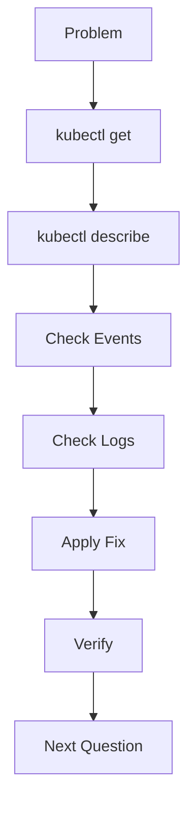

# Lab 10 - CKA Lightning Troubleshooting

## Difficulty

⭐⭐⭐⭐⭐ Expert

## Estimated Time

45–60 minutes

---

# CKA Objectives Covered

* Rapid Kubernetes troubleshooting
* Time-boxed diagnostics
* Production-style incident response
* Efficient use of kubectl
* Verification after remediation

---

# Objective

Complete ten independent troubleshooting scenarios.

Each scenario should be completed in **5 minutes or less**, simulating the pace required during the CKA exam.

For every scenario:

1. Identify the issue.
2. Run the minimum required commands.
3. Apply the fix.
4. Verify the solution.
5. Move to the next task.

---

# Lightning Troubleshooting Workflow



---

# Scenario 1 - Pending Pod

## Symptoms

```text
STATUS

Pending
```

### Goal

Find why the scheduler rejected the Pod.

### Commands

```bash
kubectl describe pod <pod-name>

kubectl get nodes
```

---

# Scenario 2 - CrashLoopBackOff

### Goal

Determine why the container repeatedly crashes.

### Commands

```bash
kubectl logs <pod-name>

kubectl logs <pod-name> --previous

kubectl describe pod <pod-name>
```

---

# Scenario 3 - ImagePullBackOff

### Goal

Identify the image pull problem.

### Commands

```bash
kubectl describe pod <pod-name>
```

Check:

* Image
* Registry
* Tag
* ImagePullSecrets

---

# Scenario 4 - Service Not Working

### Goal

Restore Service connectivity.

### Commands

```bash
kubectl get svc

kubectl describe svc <service-name>

kubectl get endpoints

kubectl get pods --show-labels
```

---

# Scenario 5 - DNS Failure

### Goal

Restore DNS resolution.

### Commands

```bash
kubectl get pods -n kube-system

kubectl logs deployment/coredns -n kube-system

kubectl run dns-test \
--image=busybox:1.36 \
-it --rm --restart=Never -- sh
```

Inside:

```sh
nslookup kubernetes.default
```

---

# Scenario 6 - PVC Pending

### Goal

Restore persistent storage.

### Commands

```bash
kubectl get pvc

kubectl describe pvc <pvc-name>

kubectl get pv

kubectl get sc
```

---

# Scenario 7 - Forbidden

### Goal

Fix RBAC.

### Commands

```bash
kubectl auth can-i get pods

kubectl get rolebindings

kubectl get clusterrolebindings
```

---

# Scenario 8 - Node NotReady

### Goal

Recover the worker node.

### Commands

```bash
kubectl get nodes

kubectl describe node <node-name>

systemctl status kubelet

journalctl -u kubelet -n 100
```

---

# Scenario 9 - API Server Unavailable

### Goal

Recover the control plane.

### Commands

```bash
systemctl status kubelet

ls /etc/kubernetes/manifests

crictl ps -a

kubectl cluster-info
```

---

# Scenario 10 - Production Incident

Users report:

* Website unavailable
* Pods Pending
* DNS failing
* PVC Pending

### Goal

Restore the application.

### Suggested Order

```text
Cluster

↓

Nodes

↓

Pods

↓

Events

↓

Networking

↓

Storage

↓

Security

↓

Verify
```

---

# Lightning Command Reference

```bash
kubectl get pods -A

kubectl describe pod <pod>

kubectl logs <pod>

kubectl logs <pod> --previous

kubectl get events --sort-by=.lastTimestamp

kubectl get nodes

kubectl describe node <node>

kubectl get svc

kubectl get endpoints

kubectl get pvc

kubectl describe pvc <pvc>

kubectl auth can-i get pods

kubectl cluster-info
```

---

# Speed Tips

✅ Read the task completely before typing.

✅ Start with `kubectl get`.

✅ Use `kubectl describe` to inspect Events.

✅ Use `kubectl logs` only after reviewing Events.

✅ Make one change at a time.

✅ Verify the fix immediately.

✅ Move on if the issue is resolved.

---

# Verification Checklist

For every scenario, confirm:

* The resource is healthy.
* Events no longer show the original error.
* The application behaves as expected.
* No new warnings have appeared.

---

# Common Exam Mistakes

❌ Editing resources before identifying the problem.

❌ Ignoring Events.

❌ Forgetting `--previous` for restarted containers.

❌ Restarting Pods unnecessarily.

❌ Forgetting to verify the fix.

❌ Spending too long on a single question.

---

# Final CKA Strategy

Follow the same process every time:

```text
Read

↓

Observe

↓

Describe

↓

Events

↓

Logs

↓

Root Cause

↓

Fix

↓

Verify

↓

Next Question
```

---

# Final Challenge

Set a timer for **50 minutes**.

Complete the following ten troubleshooting tasks without external notes:

1. Pending Pod
2. CrashLoopBackOff
3. ImagePullBackOff
4. Service failure
5. DNS failure
6. PVC Pending
7. RBAC Forbidden
8. Node NotReady
9. API Server unavailable
10. Multi-service production outage

Rules:

* Use the fewest commands possible.
* Apply only the required fix.
* Verify every solution before moving on.
* Record how long each task takes.

Your goal is to consistently solve each scenario in **under 5 minutes**, matching the pace expected during the CKA exam.

---

# Congratulations!

🎉 You have completed the **09-Troubleshooting** chapter.

You can now confidently troubleshoot:

* Pods
* Workloads
* Scheduling
* Services
* DNS
* Storage
* Security
* Nodes
* Control Plane
* Complete production incidents

using a structured, production-ready methodology suitable for both the **CKA exam** and real-world Kubernetes administration.
